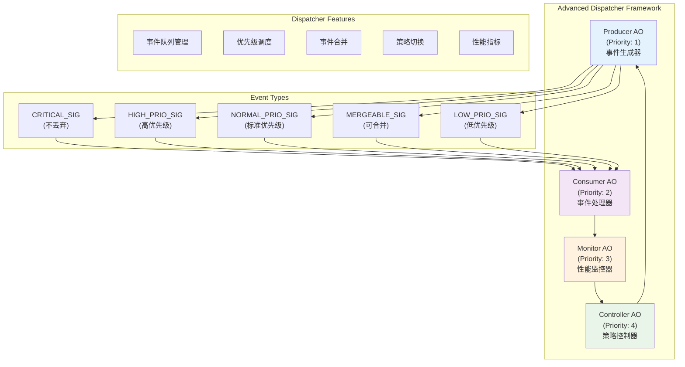
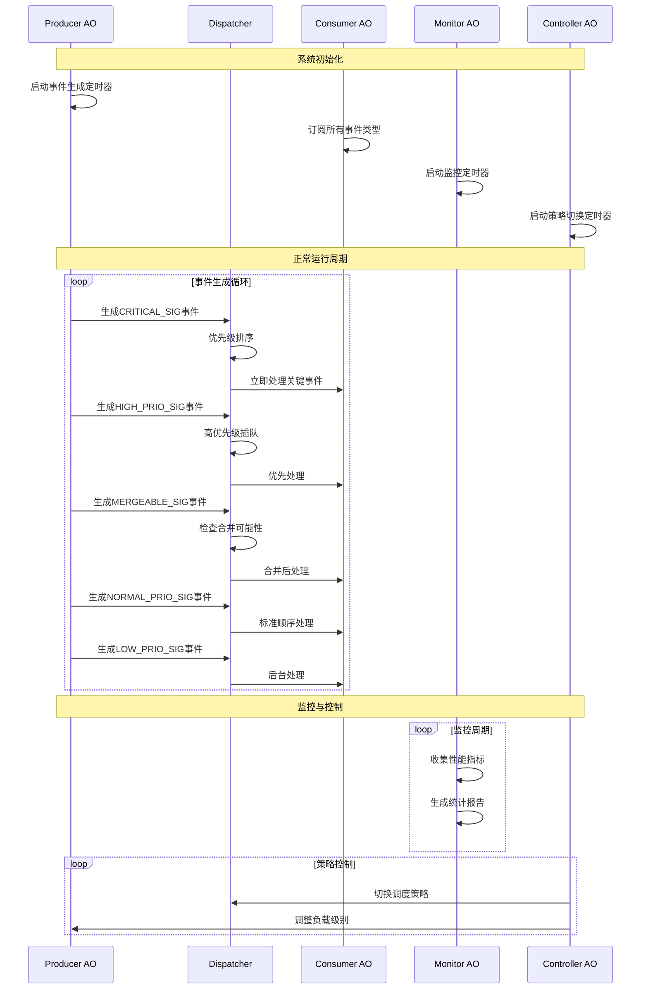
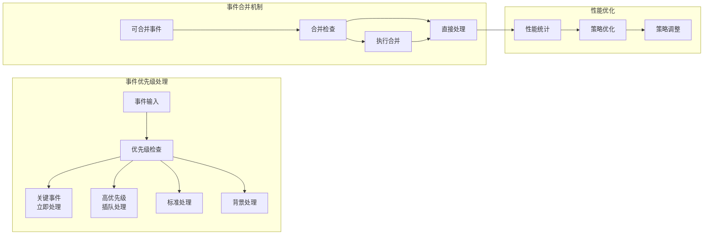

# Advanced Dispatcher Demo for RT-Thread

## 概述

本示例全面演示了 QPC 框架的高级调度器特性，展示了事件优先级处理、事件合并、关键事件、不丢弃策略、运行时策略切换以及调度器性能指标监控等高级功能。通过四个协作的主动对象，系统实现了完整的事件驱动架构，突出了 QPC 框架在复杂实时系统中的优势。

## 核心特性

### 高级调度器功能
1. **事件优先级处理**：支持多级事件优先级，确保关键事件优先处理
2. **事件合并优化**：自动合并相似事件，减少处理开销
3. **关键事件保护**：关键事件永不丢弃，保证系统可靠性
4. **运行时策略切换**：动态切换调度策略以适应不同负载
5. **性能指标监控**：实时监控调度器性能和事件处理统计

### 事件类型分级
- **CRITICAL_SIG**：关键事件，最高优先级，永不丢弃
- **HIGH_PRIO_SIG**：高优先级事件，紧急处理
- **NORMAL_PRIO_SIG**：标准优先级事件，常规处理
- **MERGEABLE_SIG**：可合并事件，优化处理效率
- **LOW_PRIO_SIG**：低优先级事件，背景处理

## 系统架构

### 主动对象设计



### 主动对象职责

1. **Producer AO（事件生产者）**
   - 根据负载级别生成各类事件
   - 模拟不同优先级的系统事件
   - 支持动态负载调节

2. **Consumer AO（事件消费者）**
   - 订阅所有类型事件
   - 展示事件优先级处理效果
   - 统计各类事件处理数量

3. **Monitor AO（性能监控）**
   - 定期报告系统指标
   - 监控事件处理性能
   - 展示调度器统计信息

4. **Controller AO（策略控制）**
   - 自动切换调度策略
   - 响应用户控制命令
   - 管理系统运行模式

## 事件流与处理机制



## 调度策略与优化

### 支持的调度策略

1. **默认策略（DEFAULT）**
   - 平衡性能和资源消耗
   - 适用于大多数应用场景
   - 支持基本事件合并

2. **高性能策略（HIGH_PERFORMANCE）**
   - 最大化事件处理吞吐量
   - 积极的事件合并
   - 优化的队列管理

3. **低延迟策略（LOW_LATENCY）**
   - 最小化事件处理延迟
   - 减少合并以降低延迟
   - 优先级严格执行

### 事件处理优化



## 系统配置与优先级

| 组件 | 优先级 | 队列大小 | 栈大小 | 职责 |
|------|--------|----------|--------|------|
| Producer AO | 1 | 20 | 256字节 | 事件生成与负载控制 |
| Consumer AO | 2 | 30 | 512字节 | 事件处理与统计 |
| Monitor AO | 3 | 15 | 256字节 | 性能监控与报告 |
| Controller AO | 4 | 10 | 256字节 | 策略控制与管理 |

## 使用方法

### 启动演示
```bash
# 自动启动（系统启动时）
# 演示会自动初始化并开始运行

# 手动启动
msh> adv_demo_start
```

### 监控与控制命令
```bash
# 显示当前性能指标
msh> adv_metrics

# 切换调度策略 (0=默认, 1=高性能, 2=低延迟)
msh> adv_strategy 1

# 设置事件生成负载级别 (1-5)
msh> adv_load 3

# 停止演示
msh> adv_demo_stop
```

### 性能监控输出示例
```
=== Dispatcher Metrics Report #5 ===
[Consumer Stats] Total: 1250, High: 125, Normal: 417, Low: 208, Mergeable: 250, Critical: 250
[System] Producer sequence: 1250, Load level: 2
[Controller] Current strategy: 1, Auto-switch: ON
=====================================
```

## 技术要点

### 事件优先级实现
- 使用 QF 的内置优先级机制
- 关键事件设置 NO_DROP 标志
- 可合并事件使用 MERGEABLE 标志

### 运行时策略切换
- 动态调整调度器行为
- 无缝切换，不影响系统运行
- 支持用户自定义策略

### 性能监控
- 实时统计事件处理数量
- 监控队列使用情况
- 跟踪策略切换效果

## 扩展与定制

### 添加新的事件类型
1. 在 `AdvancedDemoSignals` 中定义新信号
2. 在 Producer 中添加生成逻辑
3. 在 Consumer 中添加处理逻辑

### 自定义调度策略
1. 实现新的策略函数
2. 在 Controller 中添加切换逻辑
3. 配置策略参数

### 扩展性能指标
1. 添加新的统计变量
2. 在 Monitor 中扩展报告格式
3. 实现历史数据记录

## 适用场景

- **实时系统开发**：学习事件驱动架构设计
- **性能优化**：了解调度器优化技术
- **系统监控**：掌握性能指标收集方法
- **架构验证**：验证高级调度特性效果

本演示为开发者提供了完整的高级调度器特性参考实现，展示了 QPC 框架在复杂事件处理场景中的强大能力。
