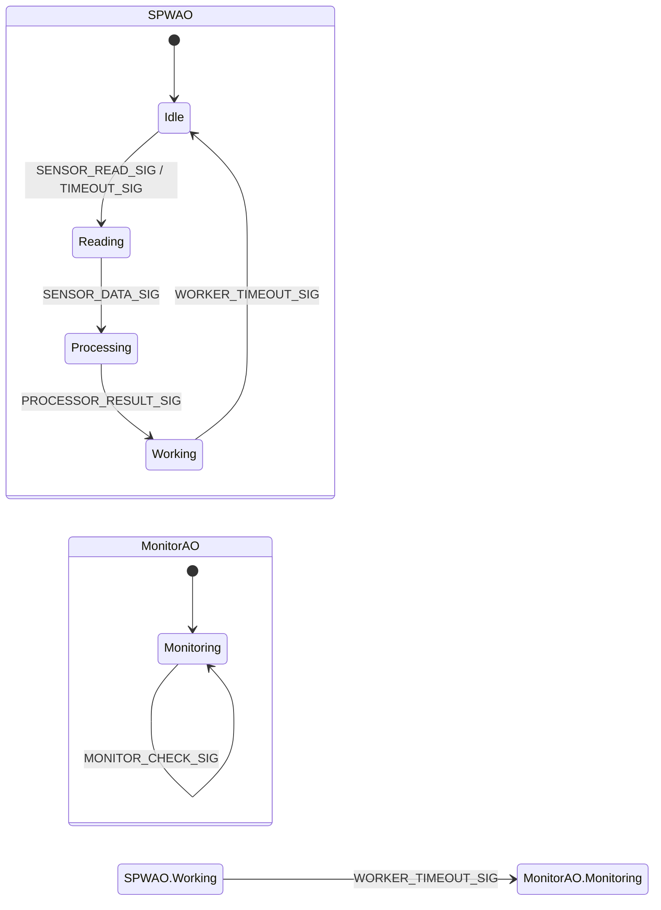
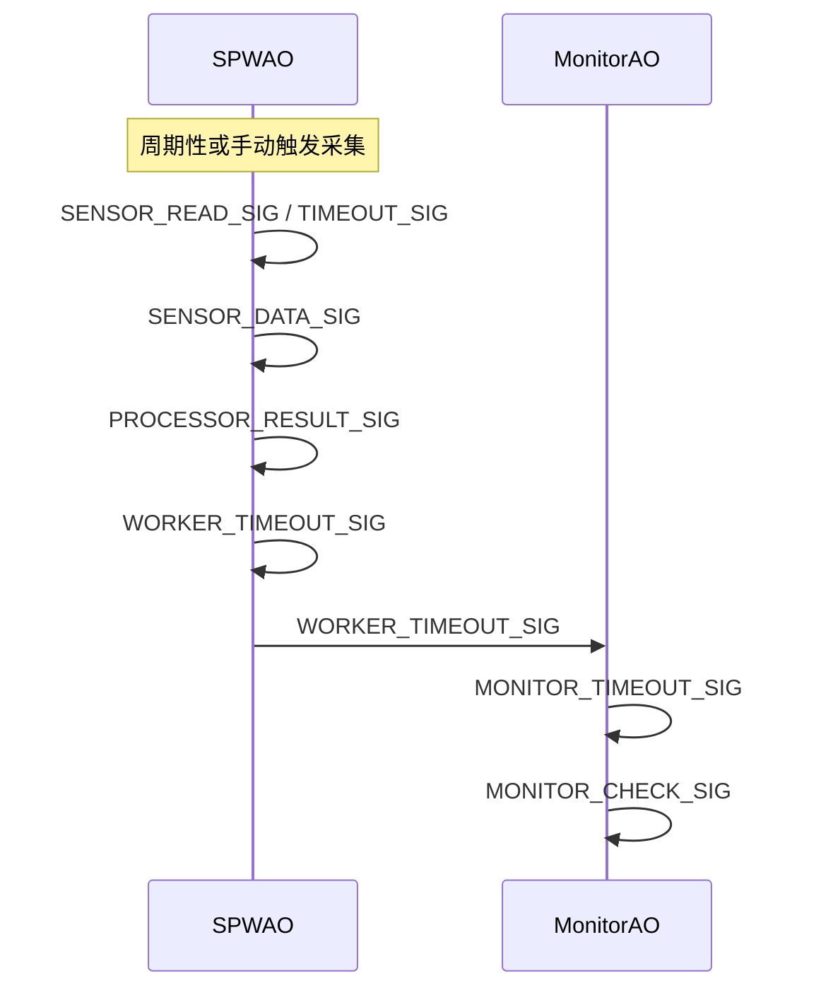
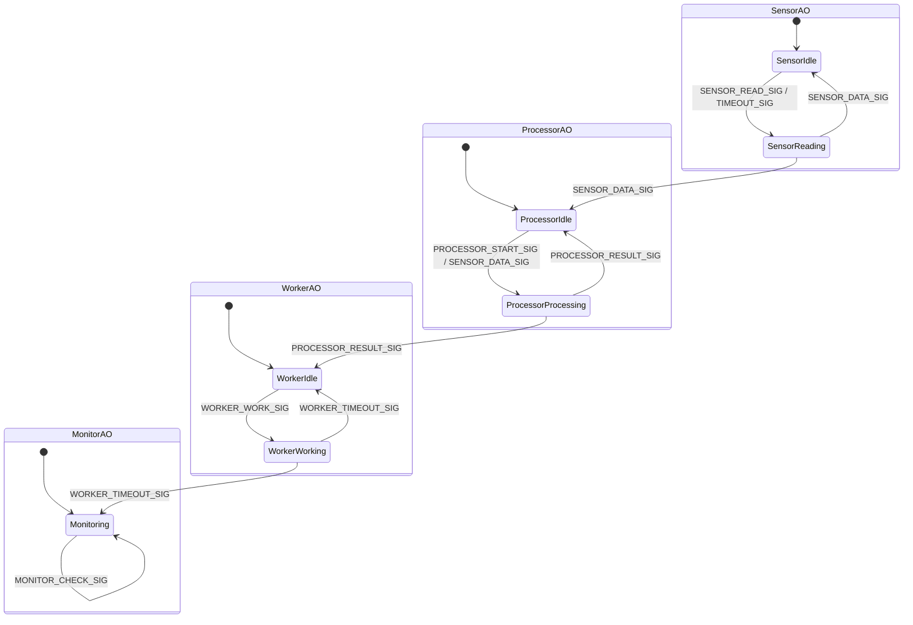
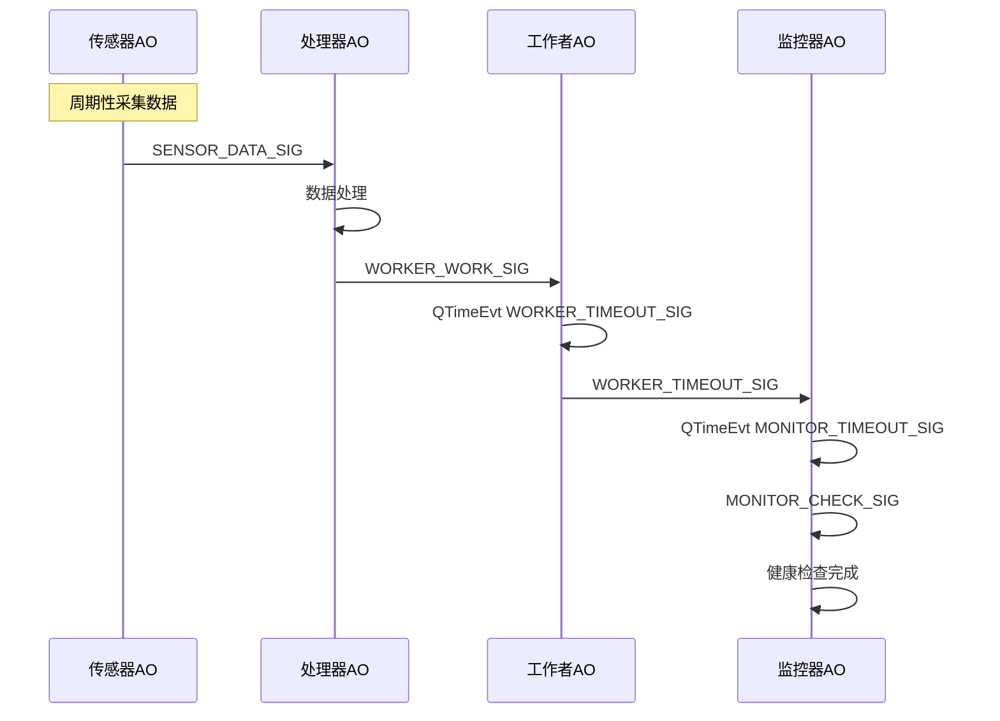

# QActive 编程入门实践

> 设计建议：在业务开发初期，不必过早纠结 AO（活动对象）是否需要拆分。应优先关注每个业务流程的状态机设计，把业务逻辑梳理清楚。后续如遇到业务复杂、并发需求或扩展性问题，再考虑将状态机拆分到不同 AO 中，实现解耦和并发。

本指南结合实际业务场景，介绍如何用 QActive 在 RT-Thread 下编写事件驱动程序。通过对比“合并AO”和“多AO拆分”两种结构，帮助初学者理解如何根据业务复杂度灵活设计系统架构。

## 概要

QActive 是一种基于事件驱动的活动对象模型，适合嵌入式系统的高效并发开发。你可以将多个业务流程（如采集、处理、工作、监控）合并在一个 AO（活动对象）中，简化结构；也可以根据业务复杂度，将其拆分为多个 AO，各自独立扩展和并发处理。

本示例工程演示了两种典型结构：

- **合并AO结构**：采集、处理、工作全部在一个 AO（SPWAO）中分阶段完成，另设一个 AO（MonitorAO）负责系统监控。适合业务简单、流程清晰的场景。
- **多AO拆分结构**：采集、处理、工作、监控分别用独立 AO 实现，适合业务复杂、各部分需独立扩展或并发的场景。

你可以根据实际需求灵活选择合适的架构。

## 1. Demo业务说明

本 Demo 业务流程包括：

- **数据采集**：周期性或手动触发采集传感器数据。
- **数据处理**：对采集到的数据进行业务处理。
- **后台工作**：处理结果后执行耗时任务。
- **系统监控**：周期性检查系统健康状态。

在合并AO结构下，采集、处理、工作三个阶段通过状态机在同一个 AO（SPWAO）中依次流转，所有事件驱动迁移，主流程清晰。MonitorAO 独立负责监控。

在多AO结构下，采集、处理、工作、监控分别由独立 AO 实现，事件在 AO 之间流转，便于各部分独立扩展和并发。

## 2. 只有两个 AO 的典型结构

在很多简单场景下，可以将所有业务流程（如采集、处理、工作）放一个 AO（如 SPWAO）中，另设一个 AO 负责系统监控（MonitorAO）。

### 两个 AO 的状态机图

### 时序图

下方时序图展示SPWAO 内部各阶段事件流转，以及与 MonitorAO 的事件交互过程。可以看到数据采集、处理、工作和监控的完整闭环。

## 3. 业务复杂时的多 AO 拆分

当业务流程变得复杂、各部分需要独立扩展或并发处理时，可以将不同功能拆分为多个 AO。例如，分别用 SensorAO、ProcessorAO、WorkerAO、MonitorAO 四个活动对象，各自实现独立状态机，通过事件进行协作。

每个 AO 的典型职责如下：

- **SensorAO（采集 AO）**：负责周期性或按需采集传感器数据，将原始数据通过事件发送给 ProcessorAO。
- **ProcessorAO（处理 AO）**：接收采集数据，完成业务处理（如算法、数据校验等），处理结果通过事件发送给 WorkerAO。
- **WorkerAO（工作 AO）**：负责执行耗时或后台任务（如数据存储、外设操作等），任务完成后通过事件通知 MonitorAO。
- **MonitorAO（监控 AO）**：周期性检查系统健康状态，接收 WorkerAO 的完成通知，进行系统状态统计、异常检测等。

这种拆分方式的优势：

1. **高内聚、低耦合**：每个 AO 只关注自身业务，便于独立开发和维护。
2. **易于扩展**：后续如需增加新功能，只需新增 AO 或扩展现有 AO 状态机。
3. **天然并发**：各 AO 间通过事件异步通信，充分利用多核或多线程资源。
4. **便于测试和调试**：每个 AO 可单独测试，定位问题更高效。

### 拆分后状态机

### 拆分后 AO 事件流与时序图

下方时序图展示了四个 AO 之间的完整事件流转。WorkerAO 在工作完成后通过 WORKER_TIMEOUT_SIG 主动通知 MonitorAO，实现业务链路与监控链路的联系。

## 其他设计需要考虑点

- **事件池必须按事件大小递增初始化，同大小事件只能用一个池。**
- **所有 8 字节事件结构体统一复用 shared8Pool，节省资源。**
- **每个 QActive 对象实现独立状态机，周期性行为由 QTimeEvt 驱动。**
- **初始化流程防止重复注册，避免 RT-Thread 对象断言失败。**
- **所有静态内存分配均加 ALIGN(RT_ALIGN_SIZE)性。**
