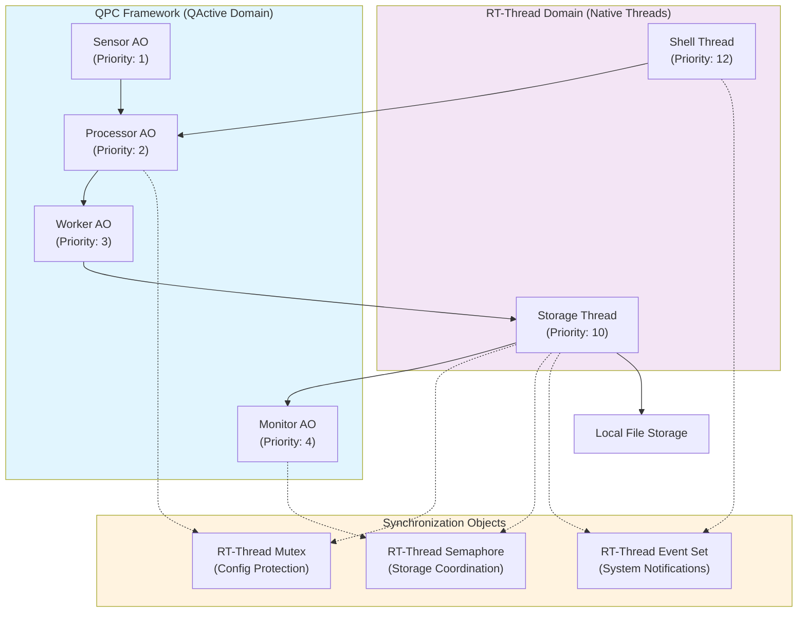
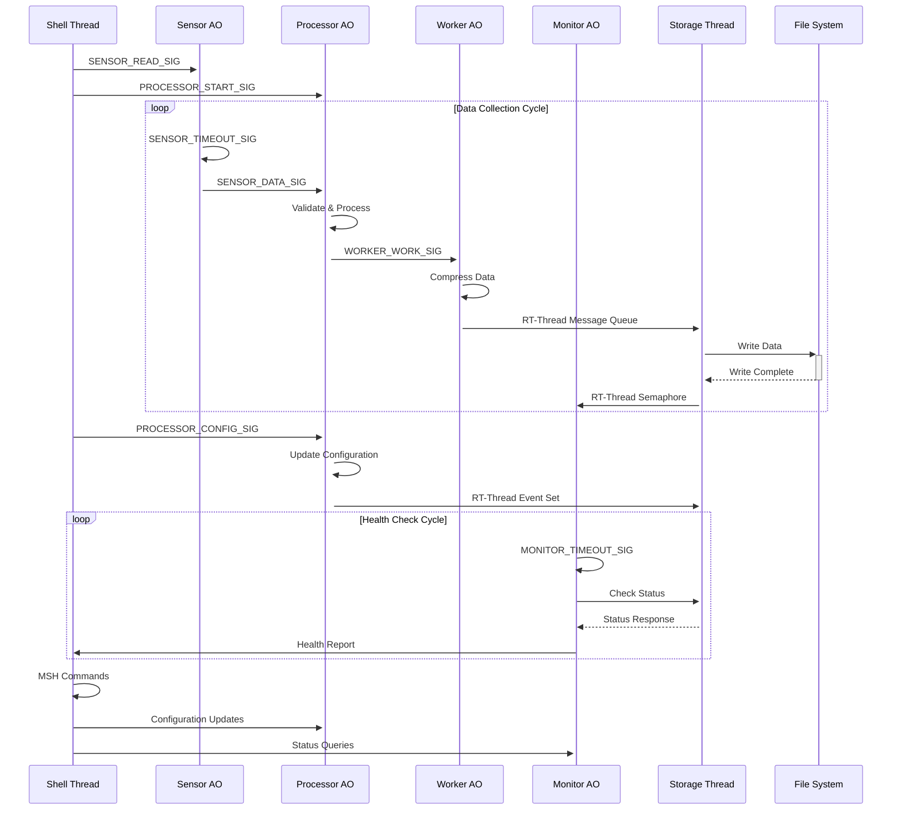
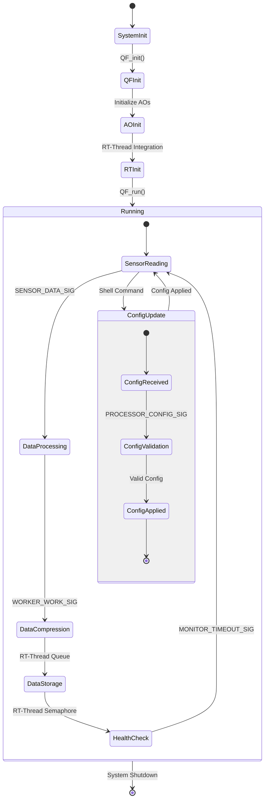
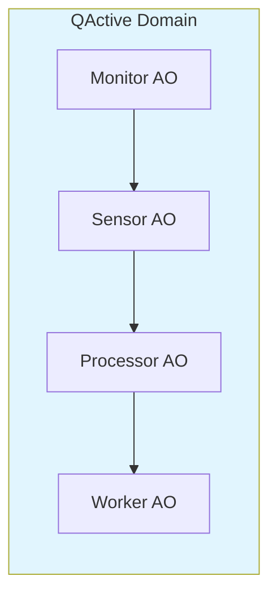
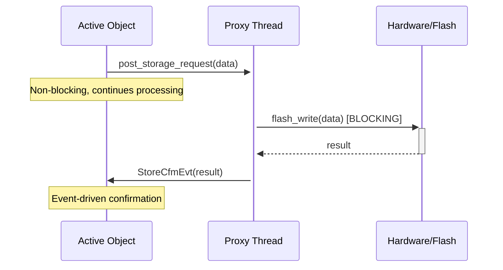

# QActive Demo for RT-Thread（QActive与RT-Thread集成演示）

本目录展示了QPC Active Objects（QActive）在RT-Thread上的原生集成与应用，适用于工业物联网网关等场景。本演示系统严格遵循MISRA C 2012编码标准，确保高质量和安全性。

## 项目简介

本演示系统以工业数据采集与存储为例，展示QPC的主动对象（QActive）与RT-Thread原生线程的协作模式。系统采用事件驱动架构，避免在Active Objects中直接使用RT-Thread阻塞API，从而保持Run-to-Completion语义。

## 系统架构

### QActive主动对象（QPC框架）
1. **Sensor AO（传感器主动对象）**：周期性采集传感器数据并发布事件
2. **Processor AO（处理器主动对象）**：处理传感器数据，响应配置更新
3. **Worker AO（工作主动对象）**：后台数据压缩与处理
4. **Monitor AO（监控主动对象）**：周期性健康检查与系统监控

### 代理线程系统（Proxy Thread Pattern）
1. **Config Proxy Thread**：处理配置读取的阻塞操作，优先级8
2. **Storage Proxy Thread**：处理Flash存储的阻塞操作，优先级7

### RT-Thread原生线程
1. **Storage Thread（存储线程）**：负责本地数据存储操作，优先级10
2. **Shell Thread（命令行线程）**：提供MSH命令接口，优先级11

### 同步与通信对象
- **互斥锁（Mutex）**：保护共享配置数据
- **信号量（Semaphore）**：协调存储操作
- **事件集（Event Set）**：系统级通知与状态同步
- **消息队列（Message Queue）**：代理线程间的非阻塞通信

## 关键设计原则

### 1. 代理线程模式（Proxy Thread Pattern）
- **问题**：Active Objects不能直接调用阻塞的RT-Thread API，否则破坏Run-to-Completion语义
- **解决方案**：将所有阻塞操作（Flash写入、配置读取）委托给独立的代理线程
- **通信方式**：AO通过QP事件与代理线程通信，代理线程完成阻塞操作后通过事件回复

### 2. 内存管理与事件池
- **基础事件池**：4字节，50个事件，用于基本信号
- **共享8字节池**：60个事件，用于SensorDataEvt和ProcessorResultEvt
- **工作16字节池**：40个事件，用于WorkerWorkEvt
- **配置64字节池**：30个事件，用于配置请求/确认（增加以支持并发）
- **存储256字节池**：20个事件，用于存储请求/确认（增加以支持并发）

## 系统结构图



## 数据流与通信机制



## 运行流程（状态图）



## 线程优先级与调度

| 组件           | 类型      | 优先级 | 栈大小      | 说明                 |
|----------------|-----------|--------|-------------|----------------------|
| Sensor AO      | QActive   | 1      | 1024字节    | 传感器采集（最高优先级）|
| Processor AO   | QActive   | 2      | 1024字节    | 数据处理与校验       |
| Worker AO      | QActive   | 3      | 1024字节    | 后台数据压缩         |
| Monitor AO     | QActive   | 4      | 1024字节    | 系统健康监控         |
| Storage Proxy  | RT-Thread | 7      | 2048字节    | Flash存储代理        |
| Config Proxy   | RT-Thread | 8      | 1024字节    | 配置读取代理         |
| Storage Thread | RT-Thread | 10     | 2048字节    | 文件存储操作         |
| Shell Thread   | RT-Thread | 11     | 1024字节    | 用户命令接口         |

## 通信机制详解

### AO间通信


### AO与代理线程通信


### 错误处理与内存管理
```c
/* MISRA C 2012 compliant error handling */
void post_storage_request(uint8_t *data, uint32_t len, QActive *requester) {
    StoreReqEvt *req = Q_NEW(StoreReqEvt, STORE_REQ_SIG);
    if (req != (StoreReqEvt *)0) {
        /* ... populate request ... */

        rt_err_t result = rt_mq_send(storage_mq, &req, STORAGE_REQ_MSG_SIZE);
        if (result != RT_EOK) {
            /* Failed to send - cleanup to prevent memory leak */
            QF_gc(&req->super);
        }
    }
}
```

## 调试信息输出

系统提供详细的调试信息，便于跟踪事件流和问题诊断：

```
[ConfigProxy] Initializing config proxy system
[ConfigProxy] Config proxy thread started successfully
[StorageProxy] Initializing storage proxy system
[StorageProxy] Storage proxy thread started successfully
[ConfigProxy] Processing config request, key=1
[ConfigProxy] Posting config confirmation, key=1
[StorageProxy] Processing storage request, len=32
[StorageProxy] Posting storage confirmation, result=0
```

## 运行控制命令

通过RT-Thread MSH命令行可以控制和监控系统：

```bash
# 启动QActive组件
qactive_start_cmd

# 停止QActive组件
qactive_stop_cmd

# 查看系统统计
qactive_stats_cmd

# 配置系统参数
qactive_config_cmd <sensor_rate> <storage_interval> [flags]

# 查看系统状态
system_status_cmd

# 重置统计信息
system_reset_cmd
```
## 故障排除

### 常见问题

**1. QF Dynamic Allocation Assertion Failed**
```
(qf_dyn) assertion failed at function:, line number:310
```
- **原因**：事件大小与事件池不匹配
- **解决方案**：检查事件结构体大小与事件池配置的匹配性

**2. 代理线程队列满**
- **症状**：存储或配置请求失败
- **解决方案**：增加队列深度或优化请求频率

**3. 内存泄漏**
- **症状**：系统运行一段时间后事件分配失败
- **解决方案**：检查所有失败路径是否正确调用QF_gc()

## 性能特征

- **响应时间**：AO响应时间 < 100μs（无阻塞操作）
- **内存使用**：总RAM使用 < 16KB（包括所有事件池和线程栈）
- **CPU利用率**：正常负载下 < 30%
- **事件吞吐量**：> 1000 events/second

## 扩展指南

### 添加新的Active Object
1. 在main.c中定义新的AO结构体和状态函数
2. 更新事件池配置以支持新的事件类型
3. 在优先级表格中分配合适的优先级
4. 添加相应的构造函数和初始化代码

### 添加新的代理线程
1. 创建新的proxy文件（如uart_proxy.c）
2. 定义请求/确认事件结构体
3. 实现代理线程函数和初始化代码
4. 在config_proxy.h中添加相关定义

## 集成优势

### 对QPC用户
- **原生RT-Thread集成**：无缝集成现有RT-Thread应用
- **丰富生态系统**：访问RT-Thread的扩展包生态
- **标准工具**：使用熟悉的RT-Thread调试和开发工具

### 对RT-Thread用户
- **事件驱动架构**：受益于QPC成熟的事件驱动框架
- **层次化状态机**：使用QPC强大的状态机功能
- **实时保证**：利用QPC的确定性行为处理关键任务

### 组合优势
- **最佳实践**：结合QPC的实时能力与RT-Thread的生态系统
- **实用集成**：面向工业应用的现实集成模式
- **可扩展设计**：架构可从简单演示扩展到复杂系统

## 代码质量保证

- **MISRA C 2012合规**：严格遵循MISRA C 2012编码标准
- **静态分析**：通过静态代码分析工具验证
- **内存安全**：所有动态内存操作都有错误检查
- **类型安全**：使用stdint.h精确宽度类型，避免移植问题
- **文档完整**：每个模块都有详细的注释和使用说明

## 文件结构

### 核心源文件
- `main.c` - 主程序，包含4个Active Objects的实现
- `config_proxy.c` - 配置代理线程，处理配置读取的阻塞操作
- `storage_proxy.c` - 存储代理线程，处理Flash存储的阻塞操作
- `rt_integration.c` - RT-Thread集成层，系统级线程管理

### 头文件
- `config_proxy.h` - 事件定义和队列配置
- `stub_flash_config.h` - Flash配置存根定义

### 辅助文件
- `stub_flash_config.c` - Flash配置存根实现
- `event_publisher.c` - 系统事件发布功能

### 测试文件（已移除）
- ~~`qpc_stubs.c`~~ - QPC存根实现（已移除，不再使用）

本项目结构经过优化，移除了不必要的文件，确保代码库清洁且易于维护。所有文件都符合MISRA C 2012标准，使用标准化的类型定义，并包含适当的调试信息。
