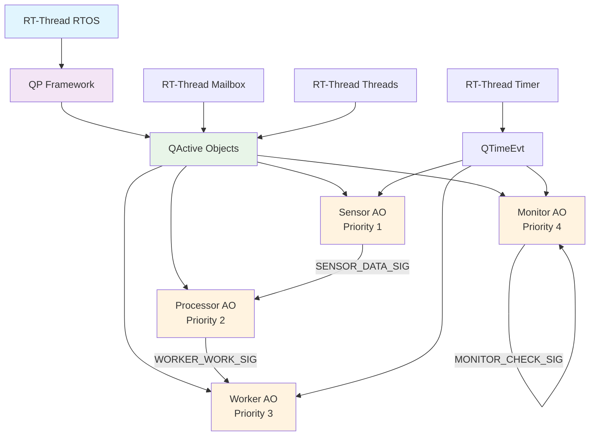
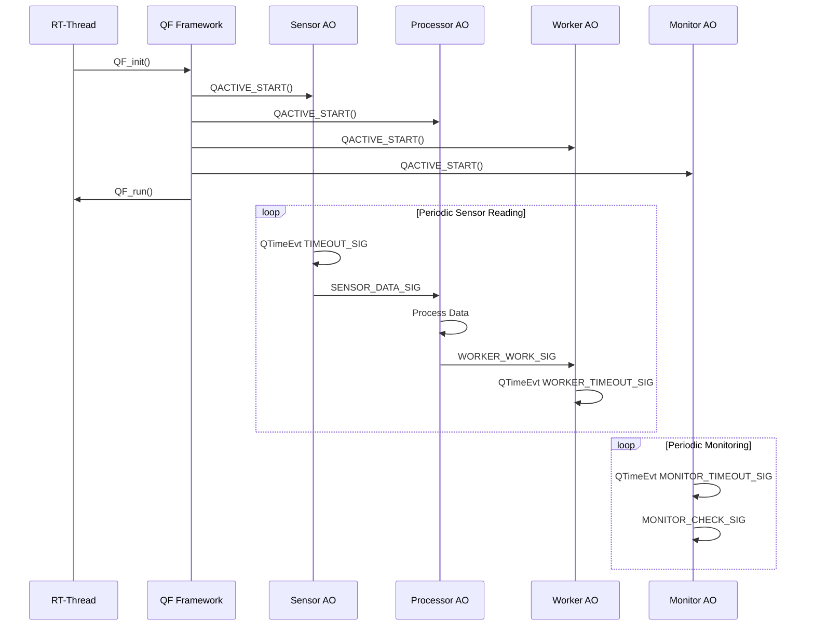

# QActive Demo for RT-Thread

This directory contains a comprehensive demonstration of QP active objects (QActive) running on RT-Thread.

## Overview

The QActive demo showcases the integration of QPC's active objects with RT-Thread's threading primitives. The demo implements a sensor data processing system with background monitoring using only QActive objects (no QXK kernel).

## Architecture



## Components

### Active Objects (QActive)
1. **Sensor AO**: Periodically reads sensor data and publishes it
2. **Processor AO**: Processes received sensor data and generates results
3. **Worker AO**: Handles background processing work from the processor
4. **Monitor AO**: Performs periodic system health monitoring

## Event Flow Sequence



## Key Features

- **Pure QActive architecture**: Uses only QActive objects without QXK kernel
- **Event-driven communication**: Uses QPC's publish-subscribe mechanism for inter-object communication
- **Timed operations**: Uses QTimeEvt for periodic behavior and delays
- **RT-Thread integration**: Uses RT-Thread mailboxes and threads for active objects
- **State machine behavior**: Each AO implements proper state machines
- **Proper QF initialization**: Includes QF_psInit() for publish-subscribe system
- **Event pool management**: Multiple event pools for different event types
- **Automatic startup**: Automatic initialization via INIT_APP_EXPORT
- **Manual control**: MSH command support for manual start/stop

## Usage

### Automatic Startup
The demo automatically starts when RT-Thread boots if `QPC_USING_QACTIVE_DEMO` is enabled in the configuration.

### Manual Control
Use the RT-Thread MSH (shell) command:
```
msh> qactive_demo_start
```

### Expected Output
```
QActive Demo: Started - 4 QActive objects
Sensor: Starting periodic sensor readings
Processor: Idle, waiting for data
Worker: Idle, waiting for work
Monitor: Starting periodic monitoring
Sensor: Reading 1, data = 266
Processor: Received sensor data = 266
Processor: Processing data (count: 1)
Worker: Received work ID 1
Worker: Processing work (total: 1)
Monitor: System check #1 - All systems operational
Worker: Work completed
Monitor: Health check completed
...
```

## Configuration

To enable the QActive demo, add the following to your RT-Thread configuration:

```c
#define QPC_USING_QACTIVE_DEMO      1
#define PKG_USING_QPC               1
#define RT_USING_FINSH              1
#define RT_USING_MAILBOX            1
```

## Build Integration

The demo is integrated into the QPC build system via:
- **SConscript**: Automatically included when `QPC_USING_QACTIVE_DEMO` is enabled
- **Dependencies**: Requires QPC with QF framework support (no QXK required)
- **RT-Thread**: Uses standard RT-Thread build system

## Files

- `main.c`: Main demo implementation with all components
- `qactive_demo.h`: Header file with signal definitions and prototypes
- `SConscript`: Build configuration for RT-Thread SCons
- `README.md`: This documentation file

## Learning Points

This demo illustrates:
1. How to create and start QActive objects on RT-Thread
2. Proper use of QF APIs (QF_init, QF_psInit, QF_run, QACTIVE_START)
3. Event-driven communication between QActive objects
4. Integration with RT-Thread's initialization and shell systems
5. Using QTimeEvt for periodic behavior and delays
6. Implementing proper state machines in QActive objects
7. Best practices for cooperative scheduling with active objects
8. Critical importance of QF_psInit() for publish-subscribe functionality
9. Event pool initialization in ascending order of event size

## Implementation Details

### QF Framework Initialization
The demo follows the correct QF initialization sequence:
1. `QF_init()` - Initialize the QF framework
2. `QF_psInit()` - Initialize publish-subscribe system 
3. `QF_poolInit()` - Initialize event pools (in ascending size order)
4. Construct Active Objects
5. `QACTIVE_START()` - Start each active object
6. `QF_run()` - Run the QF scheduler

### Event Pool Management
The demo uses multiple event pools for different event types:
- **Basic QEvt pool**: For simple events (TIMEOUT_SIG, MONITOR_CHECK_SIG)
- **SensorDataEvt pool**: For sensor data events
- **ProcessorResultEvt pool**: For processor result events  
- **WorkerWorkEvt pool**: For worker work events

**Critical**: Event pools must be initialized in ascending order of event size to prevent assertion failures in QF_new_().

## Migration from QXK

This demo was migrated from a QXK-based implementation to use only QActive objects:
- **QXThread** → **QActive** with state machines
- **QXThread_delay()** → **QTimeEvt** for timing
- **QXThread_queueGet()** → **QActive event dispatch**
- **Preemptive threads** → **Cooperative active objects**

### Common Issues and Solutions

**Problem**: Assertion failure in `qf_dyn` at line 201/210
**Cause**: Missing QF_psInit() call or incorrect event pool setup
**Solution**: 
1. Add QF_psInit() call after QF_init()
2. Ensure event pools are initialized in ascending order of event size
3. Include a basic QEvt pool for simple events

**Problem**: Event allocation failures
**Cause**: Event pools not sized correctly or missing event types
**Solution**: 
1. Add sufficient event pools for all event types
2. Size pools appropriately for expected event load
3. Initialize pools in correct order (small to large events)

## See Also

- [QPC Documentation](https://www.state-machine.com/qpc)
- [QF Framework Guide](https://www.state-machine.com/qpc/qf.html)
- [RT-Thread Documentation](https://www.rt-thread.org/document/site/)