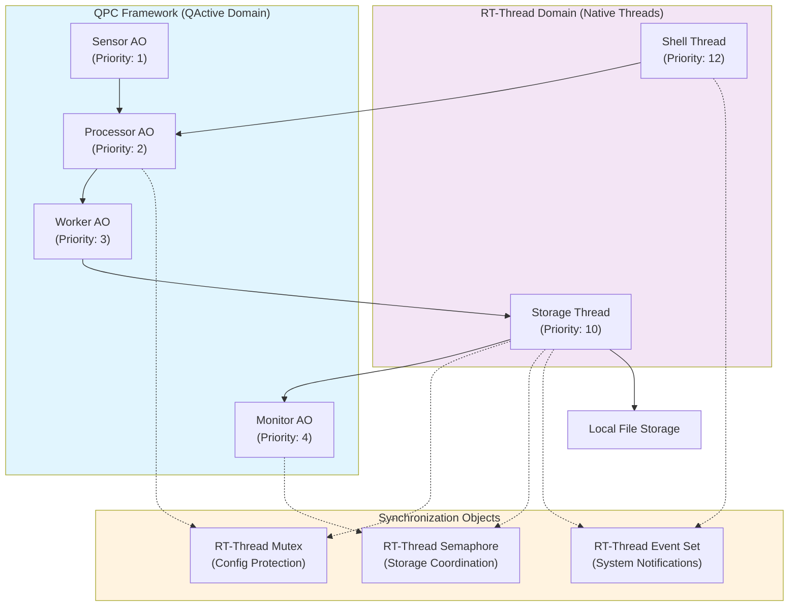
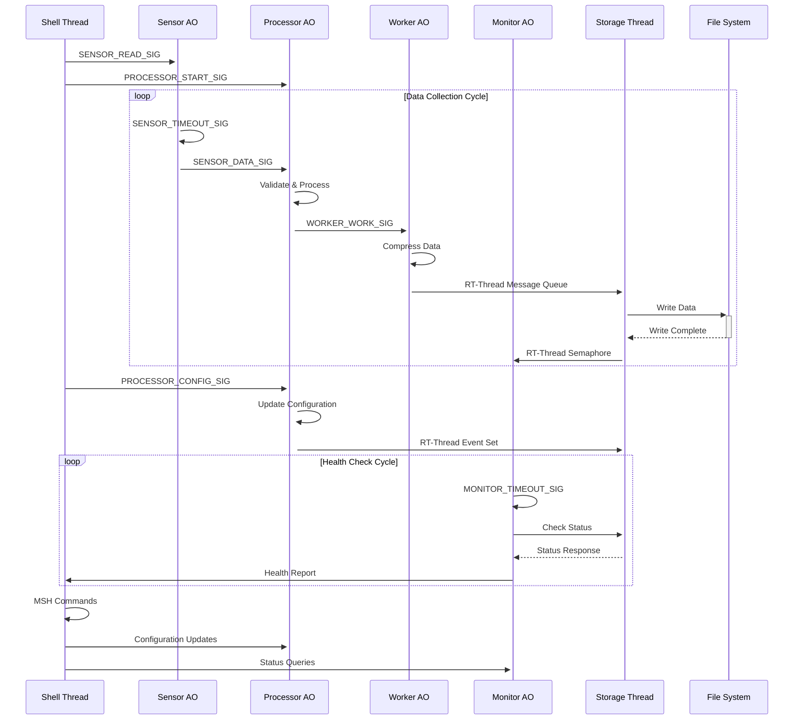
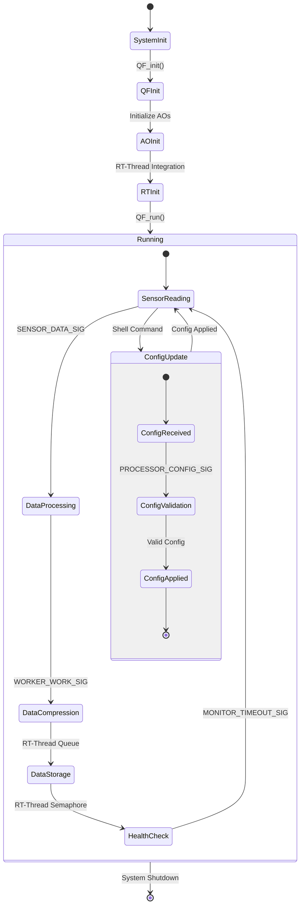

# QActive Demo for RT-Thread

This directory contains a comprehensive demonstration of QPC Active Objects (QActive) running on RT-Thread with native RT-Thread integration.

## Overview

The QActive demo showcases the integration of QPC's active objects (QActive) with RT-Thread native threads in a real-world IoT gateway scenario. The demo implements an industrial data logging system that demonstrates practical integration patterns between QPC/QActive and RT-Thread domains.

## Architecture

### QActive Components (QPC Framework)
1. **Sensor AO**: Periodically reads sensor data and publishes it
2. **Processor AO**: Processes received sensor data, handles configuration updates
3. **Worker AO**: Handles background data compression and processing
4. **Monitor AO**: Performs periodic system health monitoring

### RT-Thread Components (Native RT-Thread)
1. **Storage Thread**: Manages local data storage operations
2. **Shell Thread**: Provides RT-Thread MSH commands for system control

### Synchronization Objects
- **Mutex**: RT-Thread mutex for shared configuration protection
- **Semaphore**: RT-Thread semaphore for storage coordination
- **Event Set**: RT-Thread event set for system-wide notifications

## System Architecture



## Data Flow and Communication



## Runtime Execution Flow



## Thread Priority and Scheduling

| Component | Type | Priority | Stack Size | Description |
|-----------|------|----------|------------|-------------|
| Sensor AO | QActive | 1 (Highest) | 1024 bytes | Time-critical sensor reading |
| Processor AO | QActive | 2 | 1024 bytes | Data processing and validation |
| Worker AO | QActive | 3 | 1024 bytes | Background data compression |
| Monitor AO | QActive | 4 | 1024 bytes | System health monitoring |
| Storage Thread | RT-Thread | 10 | 2048 bytes | File system operations |
| Shell Thread | RT-Thread | 12 (Lowest) | 1024 bytes | User command interface |

## Communication Mechanisms

```mermaid
graph LR
    subgraph QActive["QActive Domain"]
        QA1["QActive Objects"]
    end
    
    subgraph RTThread["RT-Thread Domain"]
        RT1["RT-Thread Objects"]
    end
    
    subgraph Mechanisms["Communication Mechanisms"]
        Queue["RT-Thread<br/>Message Queue"]
        Mutex["RT-Thread<br/>Mutex"]
        Semaphore["RT-Thread<br/>Semaphore"]
        EventSet["RT-Thread<br/>Event Set"]
    end
    
    QA1 --> Queue
    Queue --> RT1
    
    QA1 --> Mutex
    RT1 --> Mutex
    
    RT1 --> Semaphore
    QA1 --> Semaphore
    
    RT1 --> EventSet
    QA1 --> EventSet
## Key Integration Features

### QActive → RT-Thread Communication
- **Data Transfer**: Worker AO sends processed data to Storage thread via RT-Thread message queue
- **Storage Coordination**: Worker AO triggers storage operations via RT-Thread semaphore
- **System Events**: QActive components signal system-wide events via RT-Thread event set

### RT-Thread → QActive Communication  
- **Configuration Updates**: Shell thread sends configuration changes to Processor AO via QPC events
- **Health Coordination**: Storage thread coordinates with Monitor AO via shared variables protected by RT-Thread mutex

### Bidirectional Integration
- **Statistics Sharing**: Both domains update shared statistics protected by RT-Thread mutex
- **Event Coordination**: System-wide events (health checks, errors) are coordinated via RT-Thread event set
- **MSH Commands**: RT-Thread shell commands control QActive components in real-time

## Runtime Control

### MSH Commands
The demo provides several RT-Thread MSH commands for real-time control:

```bash
# Start QActive components
msh> qactive_control start

# Stop QActive components  
msh> qactive_control stop

# Show system statistics
msh> qactive_control stats

# Configure timing parameters
msh> qactive_control config 100 500 1000

# System monitoring
msh> system_status       # Show thread status
msh> system_reset        # Reset statistics
```

### System Control Commands
Direct control over system components:

```bash
# QActive component control
msh> qactive_start_cmd       # Start QActive sensor/processor
msh> qactive_stop_cmd        # Stop QActive components  
msh> qactive_stats_cmd       # Show system statistics
msh> qactive_config_cmd      # Configure timing parameters

# System monitoring
msh> system_status_cmd       # Show thread status
msh> system_reset_cmd        # Reset statistics
```

## Expected Behavior

### Normal Operation
1. **System Startup**: QActive components initialize, RT-Thread threads start
2. **Data Collection**: Sensor AO periodically reads sensor data
3. **Data Processing**: Processor AO validates and processes sensor data
4. **Data Compression**: Worker AO compresses processed data  
5. **Data Storage**: Storage thread saves compressed data to local storage
6. **Health Monitoring**: Monitor AO performs periodic health checks
7. **Status Reporting**: Shell thread provides real-time status via MSH commands

### Integration Points
- **QActive → RT-Thread**: Processed data flows from Worker AO to Storage thread
- **RT-Thread → QActive**: Configuration updates flow from Shell thread to Processor AO
- **Bidirectional**: System statistics and health status are shared between domains

## Build and Run

### Prerequisites
- RT-Thread development environment
- QPC library package enabled
- FINSH shell component enabled
- QActive demo component enabled (`QPC_USING_QACTIVE_DEMO`)

### Build Configuration
In RT-Thread package configuration:
```
RT-Thread online packages --->
    tools packages --->
        [*] QPC: Real-Time Embedded Framework
            [*] Enable QActive Demo
```

### Compilation
```bash
# Generate build system
python tools/menuconfig.py

# Enable QPC and QActive Demo
# Navigate to packages → tools → QPC → Enable QActive Demo

# Build the project
scons -j4
```

### Running
```bash
# Run on QEMU (example for vexpress-a9)
qemu-system-arm -M vexpress-a9 -kernel rtthread.bin -nographic

# Once booted, use MSH commands
msh> qactive_control start
msh> qactive_control stats
msh> system_status_cmd
```

## Technical Details

### Memory Management
- **QActive Objects**: Use QPC's event pools for dynamic event allocation
- **RT-Thread Threads**: Use RT-Thread's dynamic memory management
- **Shared Resources**: Protected by RT-Thread synchronization primitives

### Error Handling
- **Graceful Degradation**: Components continue operation even if some fail
- **Error Reporting**: System errors are logged and reported via health monitoring
- **Recovery Mechanisms**: Automatic recovery for transient failures

### Performance Considerations
- **Priority Design**: QActive components have higher priority than RT-Thread threads
- **Event-Driven**: Efficient event-driven architecture minimizes CPU usage
- **Synchronization**: Minimal blocking through careful synchronization design

## Integration Benefits

### For QPC Users
- **Native RT-Thread Integration**: Seamless integration with existing RT-Thread applications
- **Rich Ecosystem**: Access to RT-Thread's extensive package ecosystem
- **Standard Tools**: Use familiar RT-Thread tools for debugging and development

### For RT-Thread Users
- **Event-Driven Architecture**: Benefit from QPC's proven event-driven framework
- **Hierarchical State Machines**: Use QPC's powerful state machine capabilities
- **Real-Time Guarantees**: Leverage QPC's deterministic behavior for critical tasks

### Combined Benefits
- **Best of Both Worlds**: Combine QPC's real-time capabilities with RT-Thread's ecosystem
- **Practical Integration**: Real-world patterns for industrial applications
- **Scalable Design**: Architecture scales from simple demos to complex systems

## Troubleshooting

### Common Issues
1. **Compilation Errors**: Ensure `QPC_USING_QACTIVE_DEMO` is defined
2. **Missing Commands**: Verify FINSH shell is enabled
3. **Runtime Errors**: Check thread stack sizes and priority settings
4. **Memory Issues**: Ensure adequate heap size for dynamic allocation

### Debug Tips
- Use RT-Thread's built-in debugging commands
- Monitor thread status with `list_thread` command
- Check memory usage with `list_mem` command
- Enable QPC's software tracing for detailed event flow analysis

## Source Files

- **main.c**: QActive objects implementation and main application
- **qactive_demo.h**: QActive demo signals and event definitions
- **rt_integration.c**: RT-Thread integration implementation
- **rt_integration.h**: RT-Thread integration interfaces
- **SConscript**: Build configuration for RT-Thread
- **README.md**: This documentation file

## License

This demo is part of the QPC framework and is licensed under the GPL v3 license. For commercial licensing, please contact Quantum Leaps.

---

*This demo demonstrates practical integration patterns between QPC/QActive and RT-Thread, providing a foundation for building industrial IoT applications with real-time requirements.*
msh> qactive_stats_cmd       # Show system statistics
msh> qactive_config_cmd      # Configure timing parameters
```

## Expected Behavior

1. **Sensor Data Flow**: Sensor AO generates periodic temperature/pressure readings
2. **Data Processing**: Processor AO validates sensor data and forwards to Worker AO
3. **Data Compression**: Worker AO compresses data and triggers storage operations
4. **Storage Management**: RT-Thread Storage thread handles local file operations
5. **System Monitoring**: Monitor AO performs periodic health checks
6. **Interactive Control**: MSH commands allow real-time system configuration

## Integration Benefits

- **Educational Value**: Demonstrates practical QActive/RT-Thread integration patterns
- **Industrial Relevance**: Simulates real-world IoT gateway scenarios  
- **Best Practices**: Shows proper synchronization and resource management
- **Runtime Control**: Enables dynamic system configuration and monitoring
- **Scalability**: Framework easily extended for additional components

## Building and Running

1. **Prerequisites**: RT-Thread environment with QPC package installed
2. **Configuration**: Enable `QPC_USING_QACTIVE_DEMO` in RT-Thread configuration
3. **Build**: Use RT-Thread's `scons` build system
4. **Run**: Deploy to target hardware or simulator

## Files Structure

```
qactive_demo/
├── main.c              # Main application with QActive objects
├── qactive_demo.h      # Header with signals and event definitions
├── rt_integration.c    # RT-Thread integration implementation
├── rt_integration.h    # RT-Thread integration headers
├── SConscript         # Build configuration
└── README.md          # This documentation
```

## Technical Details

### Memory Management
- Uses RT-Thread's memory management for all dynamic allocations
- QPC's publish-subscribe system for event distribution
- No complex memory pools - relies on RT-Thread's heap

### Threading Model
- QActive objects run as RT-Thread threads with QPC state machines
- RT-Thread native threads for storage and shell operations
- Proper priority assignment ensures real-time constraints

### Error Handling
- Graceful degradation on resource allocation failures
- Comprehensive error reporting via RT-Thread console
- Recovery mechanisms for transient failures

This demo represents a production-ready foundation for integrating QPC Active Objects with RT-Thread applications in embedded systems.