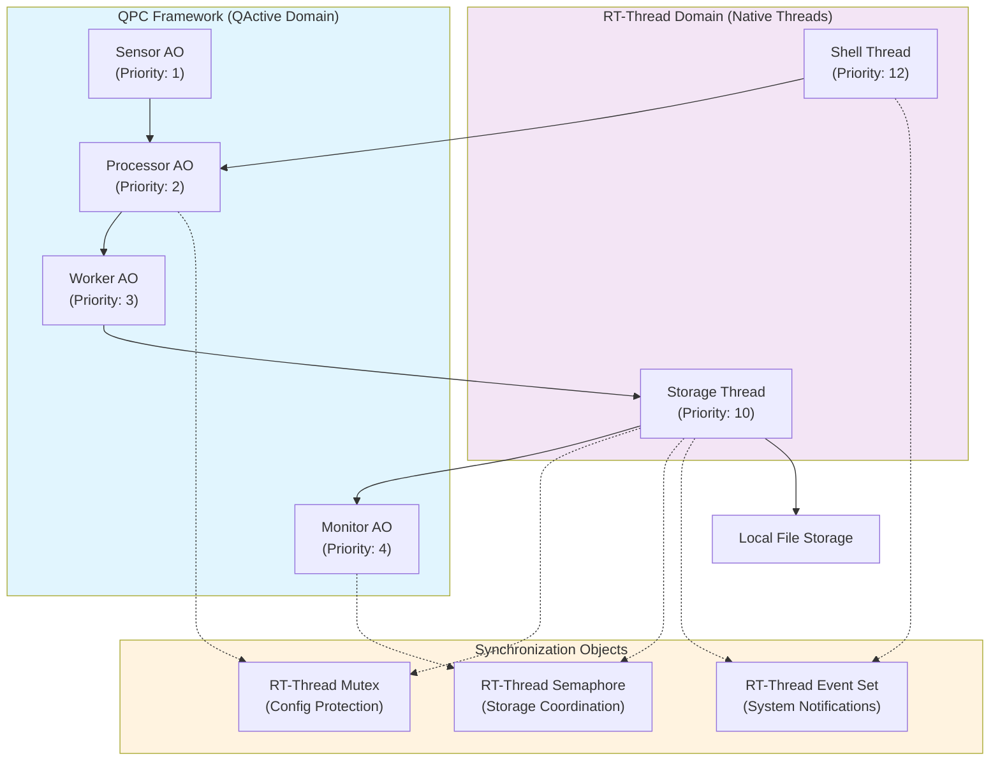
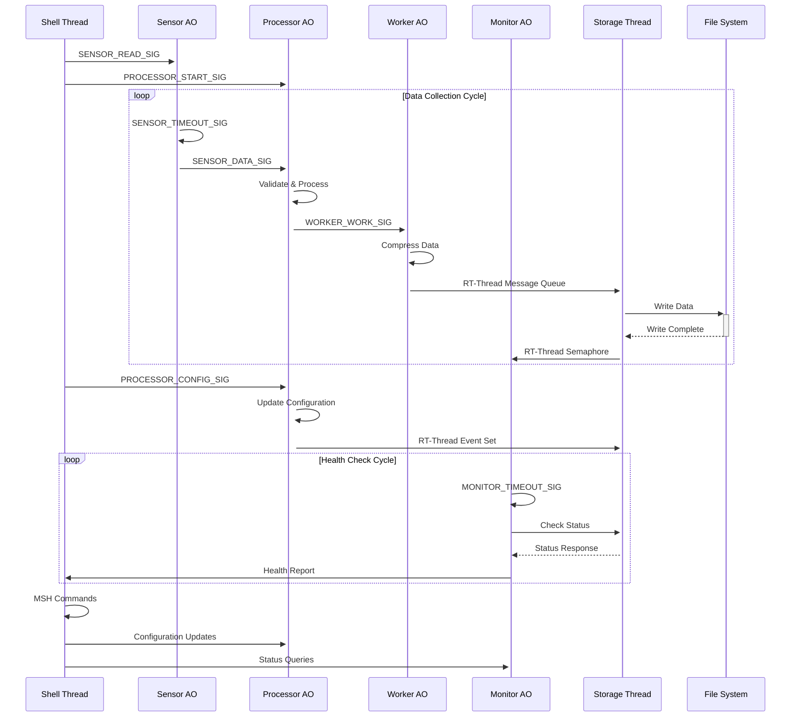
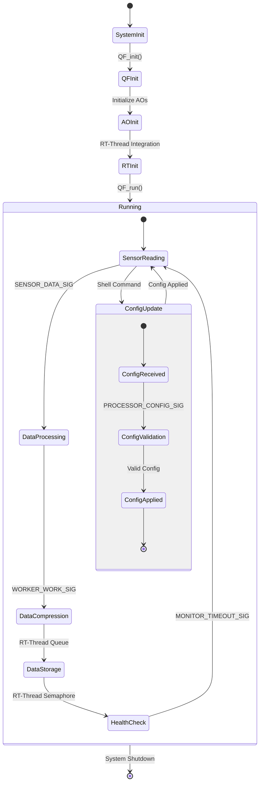
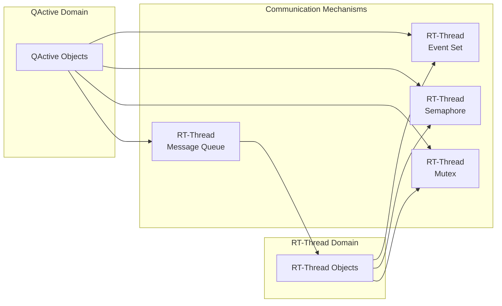

# QActive Demo for RT-Thread (block)


## 概述

本示例演示 QPC 框架下主动对象（QActive）与 RT-Thread 原生线程的协作。

## 系统架构

### QActive主动对象（QPC框架）
1. **Sensor AO（传感器主动对象）**：周期性采集传感器数据并发布事件
2. **Processor AO（处理器主动对象）**：处理传感器数据，响应配置更新
3. **Worker AO（工作主动对象）**：后台数据压缩与处理
4. **Monitor AO（监控主动对象）**：周期性健康检查与系统监控

### RT-Thread原生线程
1. **Storage Thread（存储线程）**：负责本地数据存储操作
2. **Shell Thread（命令行线程）**：提供MSH命令接口，实现系统控制

### 同步与通信对象
- **互斥锁（Mutex）**：保护共享配置
- **信号量（Semaphore）**：协调存储操作
- **事件集（Event Set）**：系统级通知与状态同步


### 当前架构缺陷
主动对象（QActive）内部直接调用RT-Thread的阻塞型API（如信号量、互斥锁等），破坏了QActive“run-to-complete”事件处理语义，导致主动对象线程可能被挂起，进而影响整个系统的实时响应能力和事件处理的确定性。

## 系统结构图



## 数据流与通信机制



## 运行流程（状态图）



## 线程优先级与调度

| 组件           | 类型      | 优先级 | 栈大小      | 说明                 |
|----------------|-----------|--------|-------------|----------------------|
| Sensor AO      | QActive   | 3      | 1024字节    | 传感器采集           |
| Processor AO   | QActive   | 4      | 1024字节    | 数据处理与校验       |
| Worker AO      | QActive   | 5      | 1024字节    | 后台数据压缩         |
| Monitor AO     | QActive   | 6      | 1024字节    | 系统健康监控         |
| Storage Thread | RT-Thread | 10     | 2048字节    | 文件存储操作         |
| Shell Thread   | RT-Thread | 12     | 1024字节    | 用户命令接口         |

## 通信机制

- QActive间通过QPC事件池和消息队列通信
- AO与RT-Thread原生线程通过消息队列、信号量、事件集等同步对象协作


### **QActive与RT-Thread集成特性**

1. **线程优先级映射**：QActive对象的优先级高于普通RT-Thread线程，确保关键任务能够实时响应。
2. **池事件快速通道机制**：QPC框架通过池事件强制事件走队列，确保每个事件在独立的线程中执行，避免对RT-Thread原生调度的干扰。
3. **同步对象统一管理**：所有的互斥锁、信号量、事件集等同步对象都通过RT-Thread原生实现，保持系统的兼容性。

### **QActive与RT-Thread通信方式**

1. **QActive → RT-Thread通信**：
   - **数据传输**：QActive通过消息队列将数据传输给存储线程。
   - **存储协调**：通过信号量触发存储操作。
   - **系统事件**：QActive通过RT-Thread事件集信号化事件。
2. **RT-Thread → QActive通信**：
   - **配置更新**：Shell线程通过QPC事件向QActive传递配置变化。
   - **健康协调**：通过互斥量保护的共享变量进行协调。
3. **双向集成**：
   - **统计信息共享**：RT-Thread和QActive共享统计数据，确保一致性。
   - **事件协调**：系统事件通过RT-Thread事件集协调。
   - **MSH命令**：Shell命令实时控制QActive组件。

### 输出结果

```
=== Advanced Dispatcher Demo Auto-Initialize ===
=== Advanced Dispatcher Demo Initialize ===
Advanced Demo: Initialization completed

==== Advanced Dispatcher Demo Starting ====
[Producer] Starting event production
[QActive_start_] AO: 6007822c, name: , registered, QHSM: 6007822c
[QActive_start_] Thread startup result: 0, state: 1
Advanced Demo: Producer AO started (Priority 1)
[Consumer] Ready to consume events
[QActive_start_] AO: 60078328, name: , registered, QHSM: 60078328
[QActive_start_] Thread startup result: 0, state: 1
Advanced Demo: Consumer AO started (Priority 2)
[Monitor] Starting system monitoring
[QActive_start_] AO: 60078420, name: , registered, QHSM: 60078420
[QActive_start_] Thread startup result: 0, state: 1
Advanced Demo: Monitor AO started (Priority 3)
[Controller] Starting automatic strategy control
[QActive_start_] AO: 60078518, name: , registered, QHSM: 60078518
[QActive_start_] Thread startup result: 0, state: 1
Advanced Demo: Controller AO started (Priority 4)
Advanced Demo: All AOs started - Demonstrating advanced dispatcher features
============================================
Advanced Demo: Already initialized, skipping...
[System] Starting Advanced Dispatcher Demo
Advan> d Demo: Already started, skipping...
[System] AmSystedvanced Demo startup completed
[thread_function] AO thread started: 60078420, name: , prio: 29, stat: 3
[thread_function] AO thread started: 60078328, name: , prio: 30, stat: 3
[thread_function] AO thread started: 60078328, name: , prio: 30, stat: 3
[I/SDIO] SD card capacity 65536 KB.
[thread_function] AO thread started: 6007822c, name: , prio: 31, stat: 3
[Consumer] HIGH_PRIO #1: data=10, seq=1
[Consumer] MERGEABLE #1: data=200, seq=2
[Consumer] NORMAL_PRIO #1: data=3000, seq=3
[Consumer] LOW_PRIO #1: data=40000, seq=4
[Consumer] CRITICAL #1: data=5, seq=5
[Consumer] HIGH_PRIO #2: data=60, seq=6
[Consumer] MERGEABLE #2: data=700, seq=7
[Consumer] NORMAL_PRIO #2: data=8000, seq=8
[Consumer] LOW_PRIO #2: data=90000, seq=9
[Consumer] CRITICAL #2: data=10, seq=10
[Consumer] HIGH_PRIO #3: data=110, seq=11
[Consumer] MERGEABLE #3: data=1200, seq=12
[Consumer] NORMAL_PRIO #3: data=13000, seq=13
[Consumer] LOW_PRIO #3: data=140000, seq=14
[Consumer] CRITICAL #3: data=15, seq=15
[Consumer] HIGH_PRIO #4: data=160, seq=16
[Consumer] MERGEABLE #4: data=1700, seq=17
[Consumer] NORMAL_PRIO #4: data=18000, seq=18
[Consumer] LOW_PRIO #4: data=190000, seq=19

=== Disp] CRITICAL #4: data=20, seq=2[Consumer Stats] Total: 20, High: 4, Nor[Consumer Stats] Total: 20, High: 4, Normal: 4, Low: 4, Mergeable: 4, Critical: 4
[System] Producer sequence: 20, Load level: 1
[Controller] Current strategy: 0, Auto-switch: ON
=====================================

[Consumer] HIGH_PRIO #5: data=210, seq=21
[Consumer] MERGEABLE #5: data=2200, seq=22
[Consumer] NORMAL_PRIO #5: data=23000, seq=23
[Consumer] LOW_PRIO #5: data=240000, seq=24
[Consumer] CRITICAL #5: data=25, seq=25
[Consumer] HIGH_PRIO #6: data=260, seq=26
[Consumer] MERGEABLE #6: data=2700, seq=27
[Consumer] NORMAL_PRIO #6: data=28000, seq=28
[Consumer] LOW_PRIO #6: data=290000, seq=29
[Controller] Switching to HIGH_PERFORMAN[Controller] Switching to HIGH_PERFORMANCE strategy
[Consumer] HIGH_PRIO #7: data=310, seq=31
[Consumer] MERGEABLE #7: data=3200, seq=32
[Consumer] NORMAL_PRIO #7: data=33000, seq=33
[Consumer] LOW_PRIO #7: data=340000, seq=34
[Consumer] CRITICAL #7: data=35, seq=35
[Consumer] HIGH_PRIO #8: data=360, seq=36
[Consumer] MERGEABLE #8: data=3700, seq=37
[Consumer] NORMAL_PRIO #8: data=38000, seq=38
[Consumer] LOW_PRIO #8: data=390000, seq=39

=== Dispatcher Metrics Reta=40, seq=4[Con[Csumonser Stauts] Total: 40, High: 8, Normer Stats] Total: 40, High: 8, Normal: 8, Low: 8, Mergeable: 8, Critical: 8
[System] Producer sequence: 40, Load level: 1
[Controller] Current strategy: 1, Auto-switch: ON
=====================================

[Consumer] HIGH_PRIO #9: data=410, seq=41
[Consumer] MERGEABLE #9: data=4200, seq=42
[Consumer] NORMAL_PRIO #9: data=43000, seq=43
[Consumer] LOW_PRIO #9: data=440000, seq=44
[Consumer] CRITICAL #9: data=45, seq=45
[Consumer] HIGH_PRIO #10: data=460, seq=46
[Consumer] MERGEABLE #10: data=4700, seq=47
[Consumer] NORMAL_PRIO #10: data=48000, seq=48
[Consumer] LOW_PRIO #10: data=490000, seq=49
[Consumer] CRITICAL #10: data=50, seq=50
[Consumer] HIGH_PRIO #11: data=510, seq=51
[Consumer] MERGEABLE #11: data=5200, seq=52
[Consumer] NORMAL_PRIO #11: data=53000, seq=53
[Consumer] LOW_PRIO #11: data=540000, seq=54
[Consumer] CRITICAL #11: data=55, seq=55
[Consumer] HIGH_PRIO #12: data=560, seq=56
[Consumer] MERGEABLE #12: data=5700, seq=57
[Consumer] NORMAL_PRIO #12: data=58000, seq=58
[Consumer] LOW_PRIO #12: data=590000, seq=59
[Co[Cntroller] Switching to LOW_LATENCY strategy
ontroller] Switching to LOW_LATENCY [Consumer Stats] Total: 59, High: 12, Normal: 12, Low: 12, Mergeable: 12, Critical: 11
[System] Producer sequence: 59, Load level: 1
[Controller] Current strategy: 2, Auto-switch: ON
=====================================

[Consumer] CRITICAL #12: data=60, seq=60
[Consumer] HIGH_PRIO #13: data=610, seq=61
[Consumer] MERGEABLE #13: data=6200, seq=62
[Consumer] NORMAL_PRIO #13: data=63000, seq=63
[Consumer] LOW_PRIO #13: data=640000, seq=64
[Consumer] CRITICAL #13: data=65, seq=65
[Consumer] HIGH_PRIO #14: data=660, seq=66
[Consumer] MERGEABLE #14: data=6700, seq=67
[Consumer] NORMAL_PRIO #14: data=68000, seq=68
[Consumer] LOW_PRIO #14: data=690000, seq=69
[Consumer] CRITICAL #14: data=70, seq=70
[Consumer] HIGH_PRIO #15: data=710, seq=71
[Consumer] MERGEABLE #15: data=7200, seq=72
[Consumer] NORMAL_PRIO #15: data=73000, seq=73
[Consumer] LOW_PRIO #15: data=740000, seq=74
```

