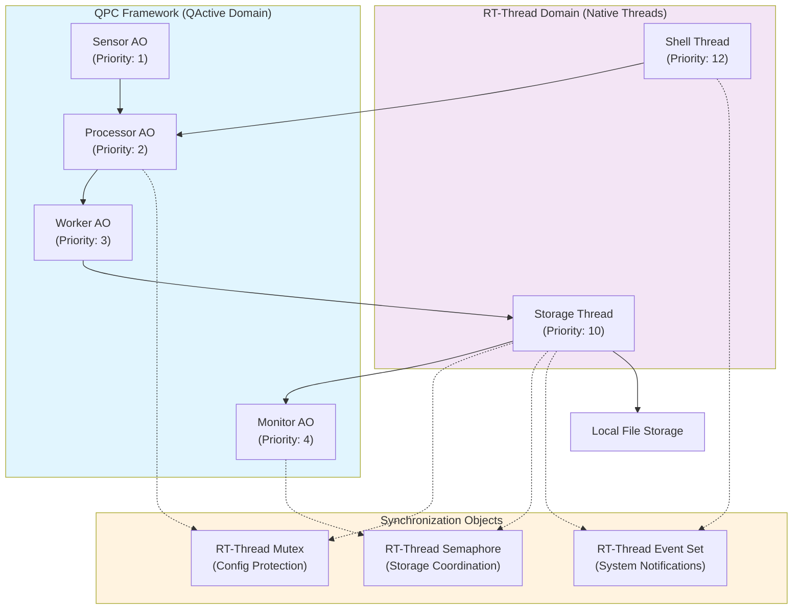
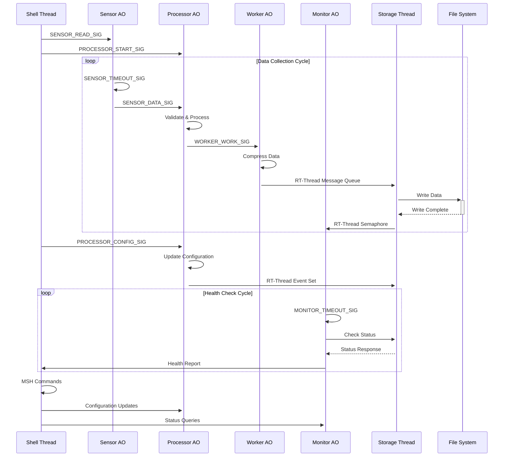
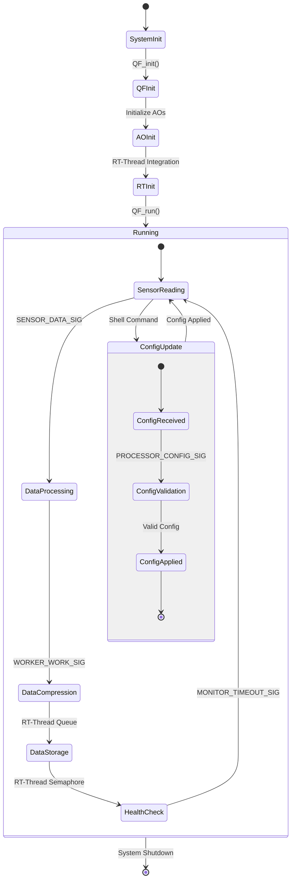
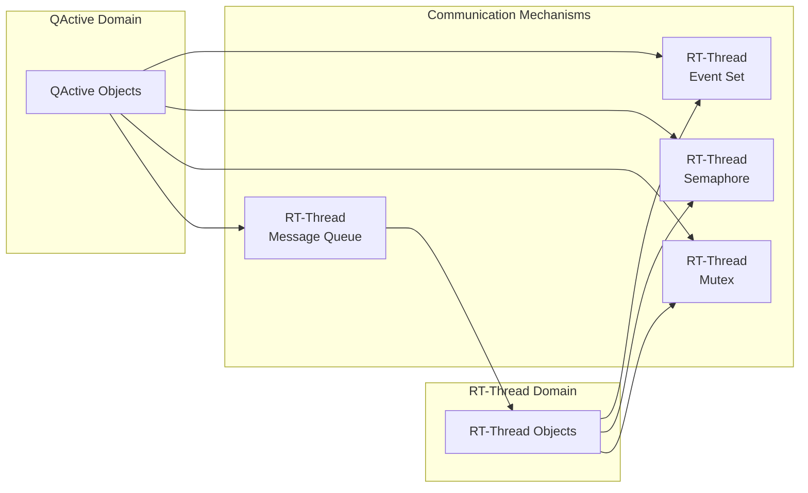

# QActive Demo for RT-Thread（QActive与RT-Thread集成演示）

本目录展示了QPC Active Objects（QActive）在RT-Thread上的原生集成与应用，适用于工业物联网网关等场景。

## 项目简介

本演示系统以工业数据采集与存储为例，展示QPC的主动对象（QActive）与RT-Thread原生线程的协作模式，涵盖事件驱动、线程调度、同步机制等关键集成点。

## 系统架构

### QActive主动对象（QPC框架）
1. **Sensor AO（传感器主动对象）**：周期性采集传感器数据并发布事件
2. **Processor AO（处理器主动对象）**：处理传感器数据，响应配置更新
3. **Worker AO（工作主动对象）**：后台数据压缩与处理
4. **Monitor AO（监控主动对象）**：周期性健康检查与系统监控

### RT-Thread原生线程
1. **Storage Thread（存储线程）**：负责本地数据存储操作
2. **Shell Thread（命令行线程）**：提供MSH命令接口，实现系统控制

### 同步与通信对象
- **互斥锁（Mutex）**：保护共享配置
- **信号量（Semaphore）**：协调存储操作
- **事件集（Event Set）**：系统级通知与状态同步

## 系统结构图



## 数据流与通信机制



## 运行流程（状态图）



## 线程优先级与调度

| 组件           | 类型      | 优先级 | 栈大小      | 说明                 |
|----------------|-----------|--------|-------------|----------------------|
| Sensor AO      | QActive   | 3      | 1024字节    | 传感器采集           |
| Processor AO   | QActive   | 4      | 1024字节    | 数据处理与校验       |
| Worker AO      | QActive   | 5      | 1024字节    | 后台数据压缩         |
| Monitor AO     | QActive   | 6      | 1024字节    | 系统健康监控         |
| Storage Thread | RT-Thread | 10     | 2048字节    | 文件存储操作         |
| Shell Thread   | RT-Thread | 12     | 1024字节    | 用户命令接口         |

## 通信机制

- QActive间通过QPC事件池和消息队列通信
- AO与RT-Thread原生线程通过消息队列、信号量、事件集等同步对象协作


### **QActive与RT-Thread集成特性**

1. **线程优先级映射**：QActive对象的优先级高于普通RT-Thread线程，确保关键任务能够实时响应。
2. **池事件快速通道机制**：QPC框架通过池事件强制事件走队列，确保每个事件在独立的线程中执行，避免对RT-Thread原生调度的干扰。
3. **同步对象统一管理**：所有的互斥锁、信号量、事件集等同步对象都通过RT-Thread原生实现，保持系统的兼容性。

### **QActive与RT-Thread通信方式**

1. **QActive → RT-Thread通信**：
   - **数据传输**：QActive通过消息队列将数据传输给存储线程。
   - **存储协调**：通过信号量触发存储操作。
   - **系统事件**：QActive通过RT-Thread事件集信号化事件。
2. **RT-Thread → QActive通信**：
   - **配置更新**：Shell线程通过QPC事件向QActive传递配置变化。
   - **健康协调**：通过互斥量保护的共享变量进行协调。
3. **双向集成**：
   - **统计信息共享**：RT-Thread和QActive共享统计数据，确保一致性。
   - **事件协调**：系统事件通过RT-Thread事件集协调。
   - **MSH命令**：Shell命令实时控制QActive组件。

### **运行时控制与技术细节**

- MSH命令用于启动、停止QActive组件、查看统计信息、配置定时参数、监控系统状态等。

- QActive使用QPC的事件池进行动态分配，RT-Thread线程使用其自身内存管理，共享资源通过RT-Thread同步原语保护。

- 采用优雅降级，系统仍可运行，错误会通过健康监控报告，并自动恢复。

- QActive组件优先级高于RT-Thread线程，事件驱动架构减少CPU占用，优化同步设计减少阻塞。

### **集成的优势**

- 支持RT-Thread生态系统和工具，支持QPC的事件驱动架构和层次化状态机，提升开发效率。

- QPC确保实时性，配合RT-Thread调度机制，保障关键任务响应。

- QPC提供性能分析工具和健康监控，RT-Thread的资源管理和调度系统提升系统优化。


## Technical Details

### Memory Management
- **QActive Objects**: Use QPC's event pools for dynamic event allocation
- **RT-Thread Threads**: Use RT-Thread's dynamic memory management
- **Shared Resources**: Protected by RT-Thread synchronization primitives

#### Event Pool Configuration
The system uses three separate event pools organized by event size:

| Event Pool | Event Types | Size | Count | Purpose |
|------------|-------------|------|-------|---------|
| basicEventPool | QEvt | 4 bytes | 50 | Basic signals (timeouts, commands) |
| shared8Pool | SensorDataEvt, ProcessorResultEvt | 8 bytes | 60 | Data and result events |
| worker16Pool | WorkerWorkEvt | 16 bytes | 40 | Work events with RT-Thread extensions |

**Critical:** WorkerWorkEvt events require 16 bytes due to RT-Thread extensions (work_id, data_size, priority). Using incorrect pool size will cause Q_NEW() assertion failures.

### Troubleshooting

#### Common Issues

**1. QF Dynamic Allocation Assertion Failed**
```
(qf_dyn) assertion failed at function:, line number:310
```
- **Cause**: Event size mismatch between requested event and available pool
- **Solution**: Verify event pool configuration matches event struct sizes
- **Check**: `sizeof(WorkerWorkEvt) = 16 bytes` requires 16-byte pool, not 8-byte pool

**2. Missing Worker AO Logs**
```
[WorkerAO_idle] WORKER_WORK_SIG - Received work ID xxx
[WorkerAO_working] WORKER_WORK_SIG - Additional work ID xxx
```
- **Cause**: WorkerWorkEvt allocation failure prevents event delivery
- **Solution**: Ensure worker16Pool is properly initialized for 16-byte events

**3. Event Pool Exhaustion**
- **Symptoms**: Intermittent failures during high event load
- **Solution**: Increase pool sizes or optimize event lifecycle
- **Monitor**: Check pool usage during peak operation

### Error Handling
- **Graceful Degradation**: Components continue operation even if some fail
- **Error Reporting**: System errors are logged and reported via health monitoring
- **Recovery Mechanisms**: Automatic recovery for transient failures

### Performance Considerations
- **Priority Design**: QActive components have higher priority than RT-Thread threads
- **Event-Driven**: Efficient event-driven architecture minimizes CPU usage
- **Synchronization**: Minimal blocking through careful synchronization design

## Integration Benefits

### For QPC Users
- **Native RT-Thread Integration**: Seamless integration with existing RT-Thread applications
- **Rich Ecosystem**: Access to RT-Thread's extensive package ecosystem
- **Standard Tools**: Use familiar RT-Thread tools for debugging and development

### For RT-Thread Users
- **Event-Driven Architecture**: Benefit from QPC's proven event-driven framework
- **Hierarchical State Machines**: Use QPC's powerful state machine capabilities
- **Real-Time Guarantees**: Leverage QPC's deterministic behavior for critical tasks

### Combined Benefits
- **Best of Both Worlds**: Combine QPC's real-time capabilities with RT-Thread's ecosystem
- **Practical Integration**: Real-world patterns for industrial applications
- **Scalable Design**: Architecture scales from simple demos to complex systems
