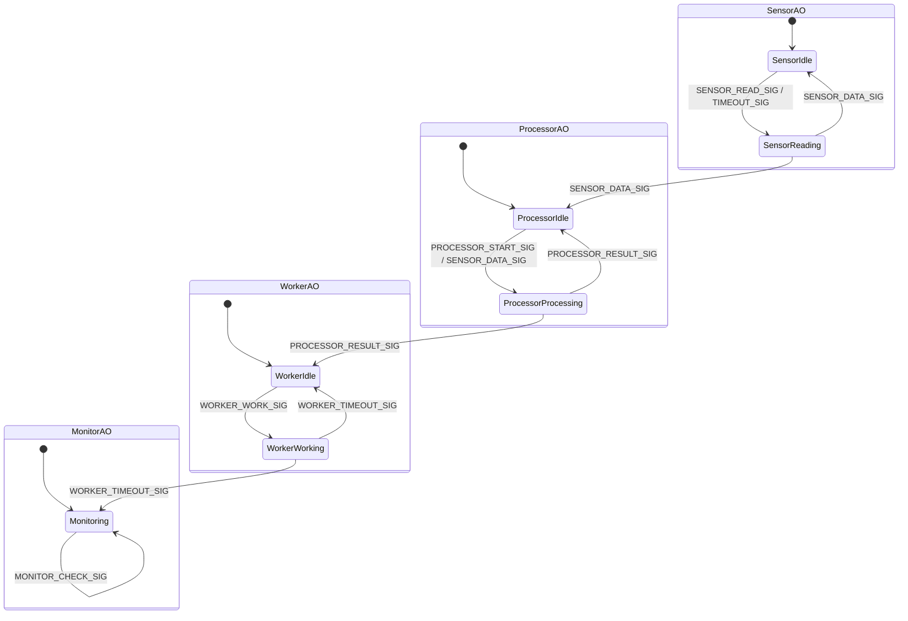
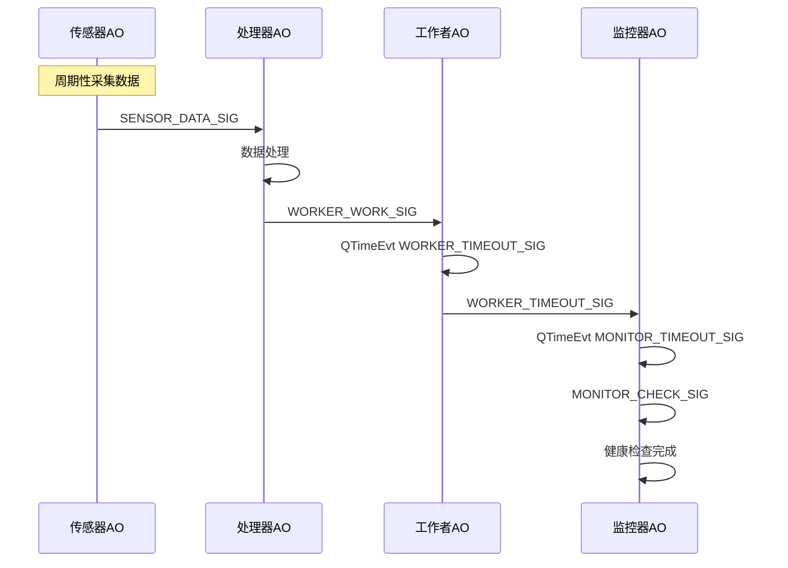

# QActive Demo for RT-Thread

本工程通过 4 个 QActive 活动对象，实现了一个传感器数据采集、处理、后台工作和系统监控的事件驱动示例。

## 工程功能说明

- **自动初始化**：系统启动时自动初始化 QF 框架、发布-订阅系统和事件池。
- **事件池设计**：所有 8 字节事件（SensorDataEvt、ProcessorResultEvt、WorkerWorkEvt）共用一个事件池，节省内存并提升效率。
- **活动对象架构**：包括传感器、处理器、工作者、监控器 4 个 QActive 对象，分别负责数据采集、处理、后台任务和健康监控。
- **时序驱动**：各对象通过 QTimeEvt 实现周期性行为。

## 状态迁移图

## 事件流与时序图



## 关键设计点

- **事件池必须按事件大小递增初始化，同大小事件只能用一个池。**
- **所有 8 字节事件结构体统一复用 shared8Pool，节省资源。**
- **每个 QActive 对象实现独立状态机，周期性行为由 QTimeEvt 驱动。**
- **初始化流程防止重复注册，避免 RT-Thread 对象断言失败。**
- **所有静态内存分配均加 ALIGN(RT_ALIGN_SIZE)性。**


## 启动与运行日志示例

```
=== QActive Demo Auto-Initialize ===
QActive Demo: Initializing...
QActive Demo: Initializing QF framework...
QActive Demo: Initializing publish-subscribe system...
sizeof(QEvt)=4
sizeof(SensorDataEvt)=8
sizeof(ProcessorResultEvt)=8
sizeof(WorkerWorkEvt)=8
QActive Demo: Initializing basic event pool...
QActive Demo: Initializing shared 8-byte event pool for SensorDataEvt, ProcessorResultEvt, WorkerWorkEvt...
QActive Demo: Starting with 4 QActive objects...
Sensor: Starting periodic sensor readings
QActive Demo: Sensor AO started
Processor: Idle, waiting for data
QActive Demo: Processor AO started
Worker: Idle, waiting for work
QActive Demo: Worker AO started
Monitor: Starting periodic monitoring
QActive Demo: Started - 4 QActive objects
QActive Demo: Already initialized, skipping...
[System] Starting QF application
QActive Demo: Already started, skipping...
[sh /> ] System startup complmsh />eted
Mensor: Reading Sensor: Reading 1, data = 137
1, data = 137
 systems operational
Ponitor: MHoealth check nitocro:mpleted
   137
H PProcessor: Processing data (count: 1)
Worker: Received work ID 1

tal: Worker: Processing work (total: 1)
Worker: Additional work ID 1001 queued
Worker: Work completed
Worker: Idle, waiting for work
Monitor: System check #2 - All systems operational
Mensor: Reading 2, data = 248

Sensor: Reading 2, data = 248
Processor: Processing additional sensor data = 248
Sensor: Reading 3, data = 101
Processor: Processing additional sensor data = 101
Srocessor: Processing additional sensor data = 101
Monitor: Health check completed
Mensor: Reading 4, data = 211
 systems operational
Monitor: Health check completed
Sonitor: Health check completeProcessor: Processing additional sensor data = 211
Monitor: System check #5 - All systems operational
Monitor: Health check completed
Sensor: Reading 5, data = 94
Processor: Processing additional sensor data = 94
Monitor: System check #6 - All systems operational
Sonitor: Health cheMonitor: Hck completeealth check completed
Processor: Processing additional sensor data = 175
Mensor: Reading 7, data = 285
 sysSensor: Reading 7, data = 285
tems operational
Mrocessor: Processing additionalProcessor: Processing additional sensor data = 285
MonsorSen: Resor: Reading 8ading 8, data = 139
 s, data = 139
ystems operationaProcessor: Processing l
aMonoitor: Hmealth cheplck completed
eted
 sensor data = 139
MSensor: Reading 9ensor: Rea, data =ding 9, data = 249
 systems operational
Monitor: Health check completed
 leteProcessor: Processing additional sensor data = 249
Monitor: System check #10 - 03
 systems operational
Sonitor: Health check completedProcessor: Processing additional sensor data = 103
Mrocessor: Processing additionalMonitor: System check #11 - All systems operational
Monitor: Health 11, data = 213
 Monitor: Health 11, data = 213
Processor: Processing additional sensor data = 213
Monitor: System check #12 - All systems operational
Sonitor: Health check completedProcessor: Processing additional sensor data = 323
Mrocessor: Processing additionalMonitor: System check #13 - All systems operational
Mensor: Reading 13, data = 177
 Sensor: Reading 13, data = 177
Processor: Processing additional sensor data = 177
Mensor: Reading 14Sensor: Reading 14, data = 287
,Processor: Processing additional sensor data = 287
ng additional sensor data = 287
 Monitor: Health check completed
...（后续周期性采集、处理、监控输出）
```

系统启动后，首先自动初始化 QF 框架、发布-订阅系统和事件池，并输出各事件结构体的大小及事件池初始化信息。随后依次启动 4 个 QActive 活动对象（传感器、处理器、工作者、监控器），每个对象启动后均有对应的日志提示。

进入运行阶段后，传感器定时采集数据并输出采集日志，处理器收到数据后进行处理并输出处理日志，工作者接收处理任务并完成后输出工作完成日志，监控器周期性进行系统健康检查并输出监控结果。
