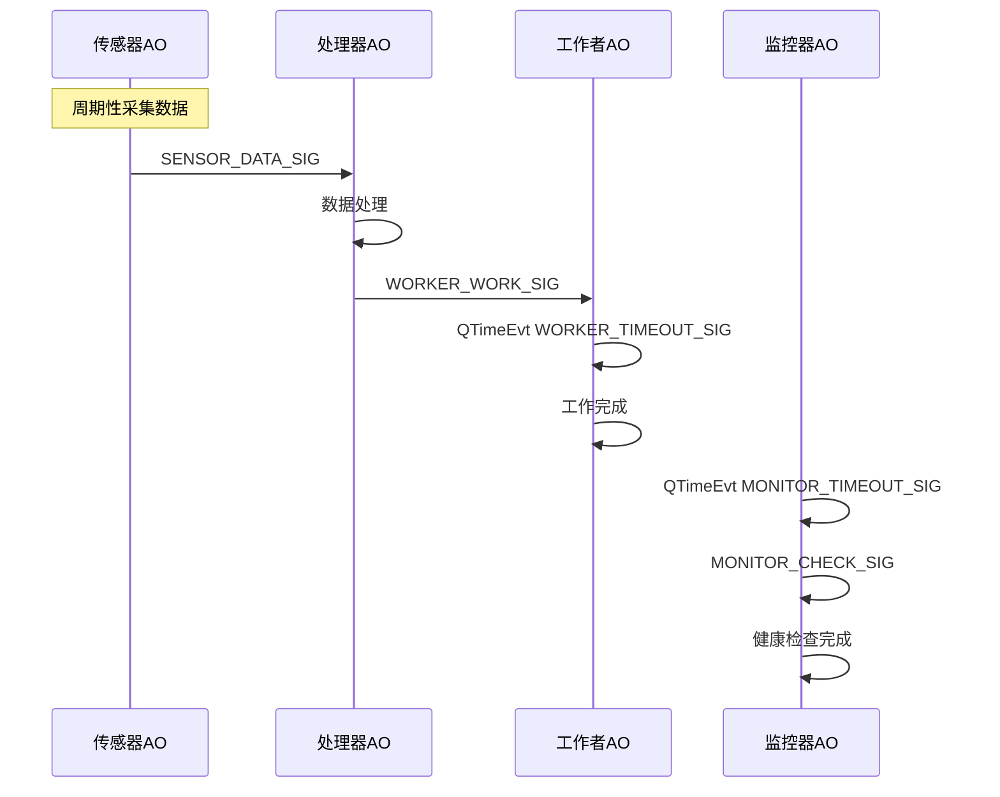

# QActive Demo for RT-Thread

本工程演示了 QPC 框架在 RT-Thread 实时操作系统上的集成与应用。通过 4 个 QActive 活动对象，实现了一个传感器数据采集、处理、后台工作和系统监控的完整事件驱动系统。

## 工程功能说明

- **自动初始化**：系统启动时自动初始化 QF 框架、发布-订阅系统和事件池。
- **事件池设计**：所有 8 字节事件（SensorDataEvt、ProcessorResultEvt、WorkerWorkEvt）共用一个事件池，节省内存并提升效率。
- **活动对象架构**：包括传感器、处理器、工作者、监控器 4 个 QActive 对象，分别负责数据采集、处理、后台任务和健康监控。
- **时序驱动**：各对象通过 QTimeEvt 实现周期性行为。
- **日志输出**：详细输出各阶段初始化和运行状态，便于调试和理解系统流程。

## 启动与运行日志示例

```
=== QActive Demo Auto-Initialize ===
QActive Demo: Initializing...
QActive Demo: Initializing QF framework...
QActive Demo: Initializing publish-subscribe system...
sizeof(QEvt)=4
sizeof(SensorDataEvt)=8
sizeof(ProcessorResultEvt)=8
sizeof(WorkerWorkEvt)=8
QActive Demo: Initializing basic event pool...
QActive Demo: Initializing shared 8-byte event pool for SensorDataEvt, ProcessorResultEvt, WorkerWorkEvt...
QActive Demo: Starting with 4 QActive objects...
Sensor: Starting periodic sensor readings
QActive Demo: Sensor AO started
Processor: Idle, waiting for data
QActive Demo: Processor AO started
Worker: Idle, waiting for work
QActive Demo: Worker AO started
Monitor: Starting periodic monitoring
QActive Demo: Started - 4 QActive objects
[System] Starting QF application
[System] System startup completed
Sensor: Reading 1, data = 242
Processor: Received sensor data = 242
Processor: Processing data (count: 1)
Worker: Received work ID 1
Worker: Processing work (total: 1)
Worker: Work completed
Worker: Idle, waiting for work
Monitor: System check #1 - All systems operational
Monitor: Health check completed
...（后续周期性采集、处理、监控输出）
```

系统启动后，首先自动初始化 QF 框架、发布-订阅系统和事件池，并输出各事件结构体的大小及事件池初始化信息。随后依次启动 4 个 QActive 活动对象（传感器、处理器、工作者、监控器），每个对象启动后均有对应的日志提示。

进入运行阶段后，传感器定时采集数据并输出采集日志，处理器收到数据后进行处理并输出处理日志，工作者接收处理任务并完成后输出工作完成日志，监控器周期性进行系统健康检查并输出监控结果。所有对象的状态和事件流转均有详细日志，便于观察系统行为和调试。

## 事件流与时序图



## 关键设计点

- **事件池必须按事件大小递增初始化，同大小事件只能用一个池。**
- **所有 8 字节事件结构体统一复用 shared8Pool，节省资源。**
- **每个 QActive 对象实现独立状态机，周期性行为由 QTimeEvt 驱动。**
- **初始化流程防止重复注册，避免 RT-Thread 对象断言失败。**
- **所有静态内存分配均加 ALIGN(RT_ALIGN_SIZE)，保证平台兼容性。**

## QActive对象调度机制
- QPC 框架中的 QActive 对象（如 Sensor、Processor、Worker、Monitor）是通过 QF 框架的**事件驱动调度机制**进行管理的：
- 事件处理必须非阻塞，否则会影响整个 QPC 系统的调度效率和实时性。
- 推荐所有 QActive 只做快速事件响应，复杂流程拆分为多个事件或用定时器驱动。

### QActive 对象的调度方式

- **事件驱动**
   每个 QActive 对象本质上是一个事件状态机（Active Object），它有自己的事件队列和状态处理函数。QPC 框架会轮询所有活动对象的事件队列，只要有事件就立即分发给对应对象处理。

- **优先级调度**
   QACTIVE_START 时为每个 QActive 分配一个优先级（如 1~4），QF 框架根据优先级调度，优先级高的对象先处理事件。

- **无阻塞设计**
   QActive 的事件处理函数（如 `SensorAO_active`、`ProcessorAO_idle` 等）应当是**非阻塞的**，即每次处理事件都应尽快返回，不做长时间阻塞或死循环。

- **后台线程/定时器**
   周期性行为通过 QTimeEvt 定时事件实现，不会阻塞主调度循环。

### 如果 QActive 线程有阻塞行为会怎样？

- **影响调度效率**
  如果某个 QActive 的事件处理函数里有阻塞（如延时、等待某资源），会导致整个 QF 框架调度停滞，其他 QActive 也无法及时处理事件，严重影响系统实时性。
- **设计原则**
  QPC 要求所有 QActive 的事件处理函数必须是非阻塞的。长时间操作应拆分为多个事件，或用定时器/异步机制实现。

## 工程文件说明

- `main.c`：主程序，包含所有活动对象和事件池实现。
- `qactive_demo.h`：信号定义及接口声明。
- `SConscript`：RT-Thread SCons 构建配置。
- `README.md`：本说明文档。

## 学习要点

- 如何在 RT-Thread 上创建和启动 QActive 对象
- QF 框架 API 的正确用法（QF_init, QF_run, QACTIVE_START）
- 活动对象间的事件驱动通信
- QTimeEvt 的周期性行为实现
- 状态机设计与 RT-Thread 集成
- 事件池设计与内存优化

## 参考资料

- [QPC 官方文档](https://www.state-machine.com/qpc)
- [QF 框架指南](https://www.state-machine.com/qpc/qf.html)
- [RT-Thread 官方文档](https://www.rt-thread.org/document/site/)
