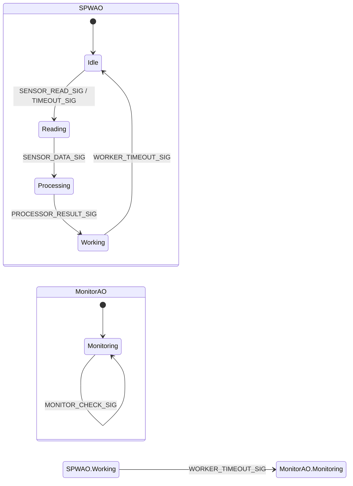
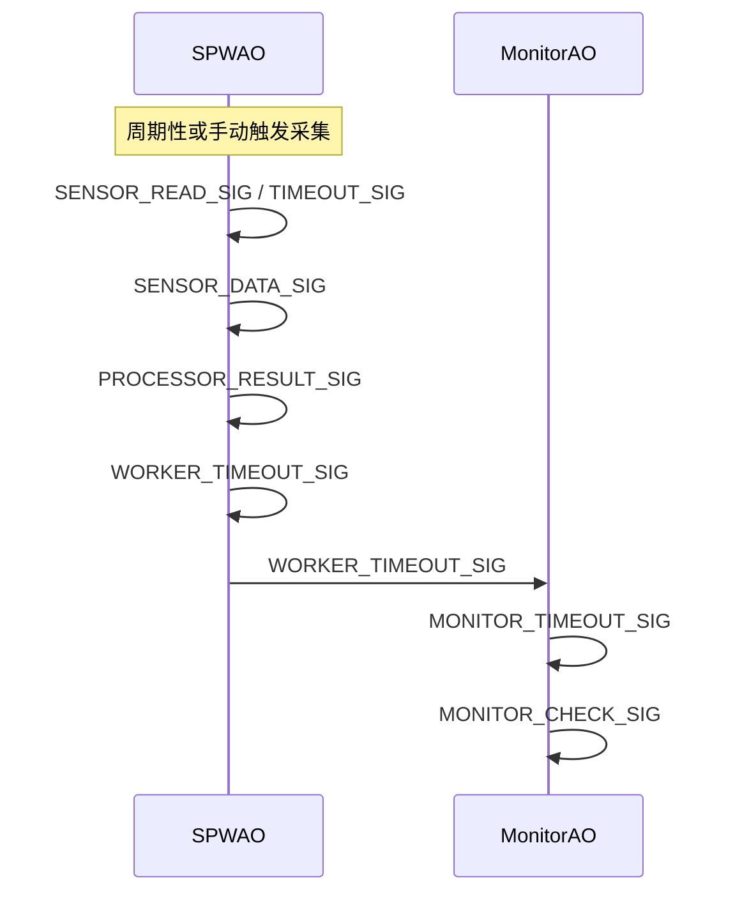

# qactive_demo_lite_merged 设计说明

  > 本工程与 `qactive_demo_lite` 工程功能类似，都是 RT-Thread 下 QActive 的事件驱动演示。
  > 区别在于本工程将原有的 SensorAO、ProcessorAO、WorkerAO 三个活动对象合并为一个 SPWAO，进一步简化结构，便于理解和维护。

## 1. 工程关联说明

- `qactive_demo_lite`：原始版本，包含 4 个 QActive 活动对象（SensorAO、ProcessorAO、WorkerAO、MonitorAO），各自实现独立状态机，功能分离。
- `qactive_demo_lite_merged`：合并版，仅保留 SPWAO（集成采集、处理、工作）和 MonitorAO，功能流程与原版一致，但实现更简洁。

- SPWAO 拆分为四个状态函数：`SPWAO_idle`、`SPWAO_reading`、`SPWAO_processing`、`SPWAO_working`。
- 每个状态只处理本阶段相关事件，迁移由事件触发。
- MonitorAO 保持原有单状态实现，周期性自检。


## 2. 状态机图

下图状态机：SPWAO 负责采集、处理和工作任务，按事件驱动在四个阶段循环切换；MonitorAO 独立负责系统监控。



## 3. 设计说明

### 3.1. SPWAO（合并Sensor Processor Worker后的主 AO）

SPWAO 负责传感器采集、数据处理、工作任务的完整流程，采用分阶段状态机实现：

- **Idle 状态**
- 等待外部 SENSOR_READ_SIG 或定时 TIMEOUT_SIG。
- 收到事件后，迁移到 Reading 状态。

- **Reading 状态**
- 执行一次传感器采集，生成数据。
- 采集完成后，发送 SENSOR_DATA_SIG 给自身，迁移到 Processing 状态。

- **Processing 状态**
- 对采集到的数据进行处理，生成结果。
- 处理完成后，发送 PROCESSOR_RESULT_SIG 给自身，迁移到 Working 状态。

- **Working 状态**
- 执行工作任务（如模拟耗时处理）。
- 工作完成后，收到 WORKER_TIMEOUT_SIG，迁移回 Idle 状态。
- 同时向 MonitorAO 发送 WORKER_TIMEOUT_SIG，通知监控 AO。

### 3.2. MonitorAO（监控 AO）

  MonitorAO 独立运行，负责周期性系统自检：

  - **Monitoring 状态**
    - 周期性定时（MONITOR_TIMEOUT_SIG）和自检（MONITOR_CHECK_SIG）保持在 Monitoring 状态。
    - 收到 SPWAO 的 WORKER_TIMEOUT_SIG 可用于扩展监控逻辑。

### 3.3. 事件驱动迁移

  - 所有状态迁移均由事件驱动，保证流程清晰、可扩展。
  - AO 间通过事件进行解耦通信，主流程与监控流程互不干扰。


### 3.4. 事件流与时序图

下方时序图展示SPWAO 内部各阶段事件流转，以及与 MonitorAO 的事件交互过程。可以看到数据采集、处理、工作和监控的完整闭环。



## 4. 启动与运行日志示例

```
=== QActive Demo Auto-Initialize ===
QActive Demo: Initializing...
QActive Demo: Initializing QF framework...
QActive Demo: Initializing publish-subscribe system...
sizeof(QEvt)=4
sizeof(SensorDataEvt)=8
sizeof(ProcessorResultEvt)=8
sizeof(WorkerWorkEvt)=8
QActive Demo: Initializing basic event pool...
QActive Demo: Initializing shared 8-byte event pool for SensorDataEvt, ProcessorResultEvt, WorkerWorkEvt...
QActive Demo: Starting with 2 QActive objects (1 combined, 1 original Monitor)...
SPW_AO: Idle - waiting for SENSOR_READ_SIG or TIMEOUT_SIG
QActive Demo: SPW AO started
Monitor: Starting periodic monitoring
QActive Demo: Monitor AO started
QActive Demo: Started - 2 QActive objects
QActive Demo: Already initialized, skipping...
[System] Starting QF application
QActive Demo: Already started, skipping...
[System] System startup completed
SPW_AO: Idle - periodic read triggered
SPW_AO: Reading - Reading 1, data = 134
SPW_AO: Processing - processing data (count: 1)
SPW_AO: Working - processing work (total: 1)
SPW_AO: Working - work completed
SPW_AO: Idle - waiting for SENSOR_READ_SIG or TIMEOUT_SIG
Monitor: System check #2 - All systems operational
Monitor: Health check completed
SPW_AO: Idle - periodic read triggered
SPW_AO: Reading - Reading 2, data = 48
SPW_AO: Processing - processing data (count: 2)
SPW_AO: Working - processing work (total: 2)
Monitor: System check #3 - All systems operational
Monitor: Health check completed
SPW_AO: Working - work completed
SPW_AO: Idle - waiting for SENSOR_READ_SIG or TIMEOUT_SIG
Monitor: System check #4 - All systems operational
Monitor: Health check completed
SPW_AO: Idle - periodic read triggered
SPW_AO: Reading - Reading 3, data = 228
SPW_AO: Processing - processing data (count: 3)
SPW_AO: Working - processing work (total: 3)
SPW_AO: Working - work completed
SPW_AO: Idle - waiting for SENSOR_READ_SIG or TIMEOUT_SIG
Monitor: System check #5 - All systems operational
Monitor: Health check completed
SPW_AO: Idle - periodic read triggered
SPW_AO: Reading - Reading 4, data = 132
SPW_AO: Processing - processing data (count: 4)
SPW_AO: Working - processing work (total: 4)
Monitor: System check #6 - All systems operational
Monitor: Health check completed
SPW_AO: Working - work completed
SPW_AO: Idle - waiting for SENSOR_READ_SIG or TIMEOUT_SIG
```
