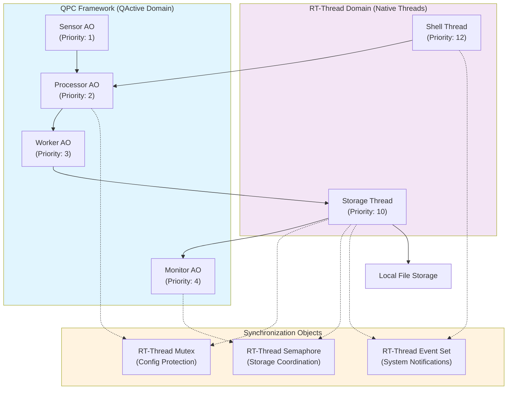
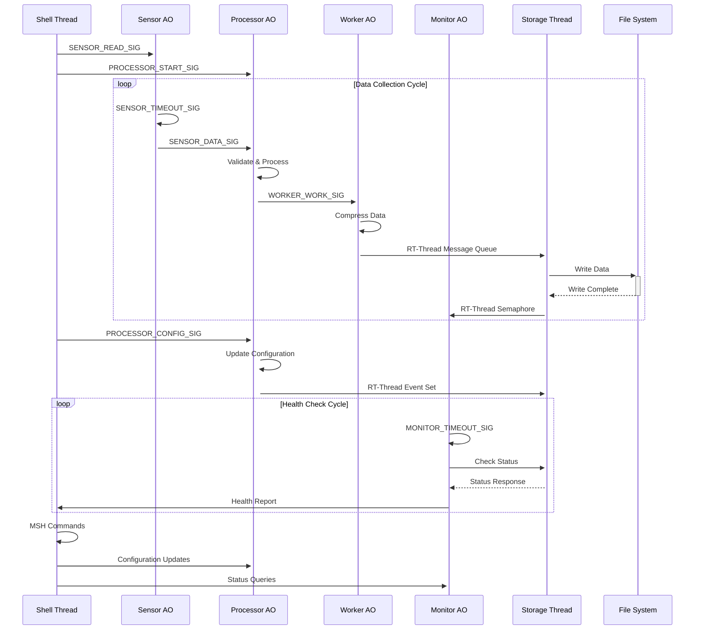
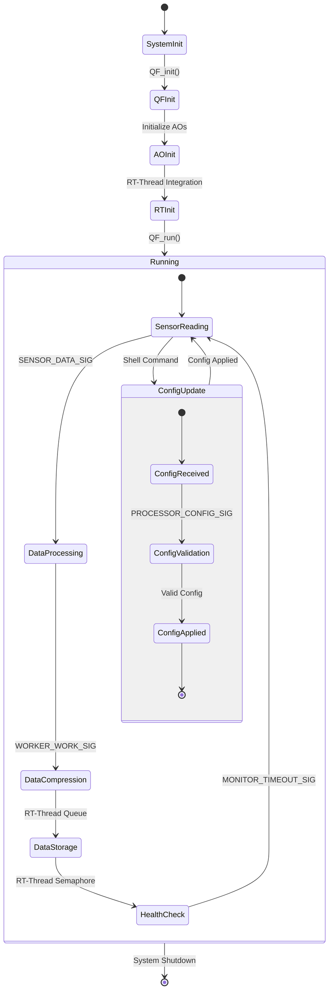
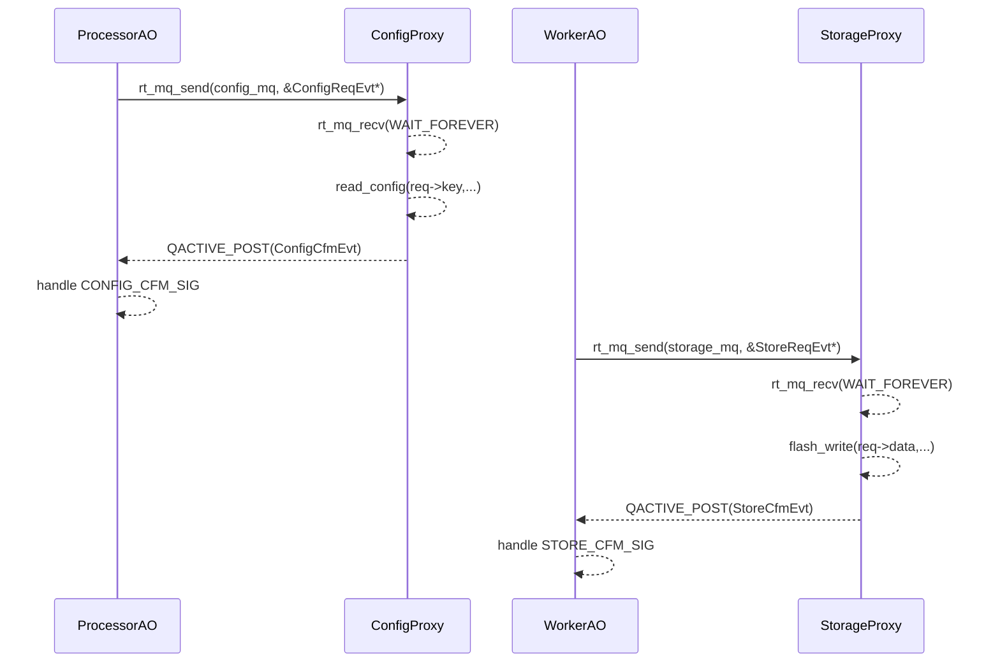

# QActive Demo 非阻塞示例程序设计文档

## 0. 概述

使用 **QP/C 的 QActive Active Object 模型** 构建一个 *AO 非阻塞 / 外围阻塞代理* 的事件驱动示例程序。
 核心策略：**AO 状态机内不直接调用会阻塞线程的 RT-Thread IPC/延时 API；所有可能阻塞的外设访问、配置、存储等操作托管给独立代理线程，通过事件异步交互。**

## 1. 设计目标

1. AO 事件处理函数（状态机回调）保持 *Run-to-Completion*：处理单个事件期间不主动阻塞自身线程。
2. 移除 AO 内直接调用 `rt_sem_take()`、`rt_mutex_take()`、`rt_thread_mdelay()` 等阻塞原语。
3. 所有延时统一使用 **QTimeEvt**；所有需要等待外部资源的场景通过 **代理线程 + 消息队列 + 回传事件** 实现。
4. 为主要事件类型建立独立事件池；为代理通信建立指针消息队列；不可阻塞 AO。
5. 可从日志追踪 AO 启动、事件流、代理处理、确认回传；便于验证功能与资源余量。

## 2. 系统架构

### 2.1 Active Objects

| AO              | 主要信号输入                                               | 行为概要                                                     | 输出事件/动作                              |
| --------------- | ---------------------------------------------------------- | ------------------------------------------------------------ | ------------------------------------------ |
| **SensorAO**    | 定时触发（QTimeEvt）                                       | 周期采样（示例中模拟随机数据），封装 `SensorDataEvt` 发送给 ProcessorAO。 | `SENSOR_DATA_SIG`                          |
| **ProcessorAO** | `SENSOR_DATA_SIG`，`PROCESSOR_START_SIG`，`CONFIG_CFM_SIG` | 聚合/处理传感器数据；按场景发起配置请求；生成一到多条 `WorkerWorkEvt` 投递给 WorkerAO；接收配置确认。 | `WORKER_WORK_SIG`，必要时 `CONFIG_REQ_SIG` |
| **WorkerAO**    | `WORKER_WORK_SIG`，`STORE_CFM_SIG`                         | 启动工作定时（QTimeEvt）模拟处理；完成后构造 `StoreReqEvt` 投递给 StorageProxy；等待存储确认。 | `STORE_REQ_SIG`                            |
| **MonitorAO**   | 周期触发（QTimeEvt），自发 `MONITOR_CHECK_SIG`             | 周期自检；发布 `MONITOR_CHECK_SIG`（发布-订阅广播）；记录健康计数。 | `MONITOR_CHECK_SIG`（publish）             |

> 所有 AO 通过 `QACTIVE_START()` 启动，被映射为各自的 **RT-Thread 线程**，并在其事件循环中处理来自 `QEQueue` 的事件。

### 2.2 代理线程（Proxy Threads）

阻塞操作集中在代理线程中完成：

| Proxy            | 等待IPC                | 输入事件指针类型 | 外部动作               | 向 AO 回传信号   |
| ---------------- | ---------------------- | ---------------- | ---------------------- | ---------------- |
| **ConfigProxy**  | `config_mq` (指针队列) | `ConfigReqEvt*`  | `read_config()` (阻塞) | `CONFIG_CFM_SIG` |
| **StorageProxy** | `storage_mq`           | `StoreReqEvt*`   | `flash_write()` (阻塞) | `STORE_CFM_SIG`  |


- 队列项类型为 **事件指针**（避免复制大对象）。
- 发送使用非阻塞 `rt_mq_send`；若返回 `-RT_EFULL`，立即通过事件反馈失败。
- 代理线程在完成工作后使用 `QACTIVE_POST()` 向请求 AO 发确认事件，并负责回收（`QF_gc()`）原始请求事件。


### 2.3 线程优先级分配与命名

系统各线程优先级分配如下（数值越小优先级越高）：

| 优先级 | 组件           | 线程名         | 说明                   | 备注                         |
|--------|----------------|----------------|------------------------|------------------------------|
| 1      | SensorAO       | sensor_ao      | 传感器数据采集         | 响应性最高                   |
| 2      | ProcessorAO    | processor_ao   | 数据处理               | 实时性高                     |
| 3      | WorkerAO       | worker_ao      | 工作任务处理           | 中等优先级                   |
| 4      | MonitorAO      | monitor_ao     | 系统监控               | 中等优先级                   |
| 7      | Storage Proxy  | strTh          | Flash/存储代理         | 低于AO，高于后台             |
| 8      | Config Proxy   | cfgTh          | 配置访问代理           | 低于AO，高于后台             |
| 10     | RT-Thread存储  | storage        | RT-Thread存储线程      | 后台服务                     |
| 11     | RT-Thread Shell| shell          | RT-Thread shell线程    | 后台服务                     |
| 15+    | Background     | idle, etc.     | 系统空闲及其它任务      | 最低优先级                   |

#### 设计原则
1. **Active Objects (1-4)**：最高优先级，确保 Run-to-Completion 语义。
2. **Proxy Threads (7-8)**：中等优先级，及时响应 AO 请求。
3. **RT-Thread 服务 (10-11)**：较低优先级，系统服务。
4. **后台任务 (15+)**：最低优先级，仅用于非关键操作。

### 2.4 队列与事件池配置

| 组件         | 队列深度 | 说明                       |
|--------------|----------|----------------------------|
| Config Proxy | 8        | 从4提升，减少队列满概率    |
| Storage Proxy| 8        | 从4提升，减少队列满概率    |

| 事件池类型   | 数量 | 事件类型                        | 说明                       |
|--------------|------|--------------------------------|----------------------------|
| 基础(4B)     | 50   | QEvt                           | 基本事件                   |
| 共享(8B)     | 60   | SensorDataEvt, ProcessorResultEvt| 数据事件                  |
| Worker(16B)  | 40   | WorkerWorkEvt                  | 工作事件                   |
| Config(64B)  | 30   | ConfigReqEvt, ConfigCfmEvt     | 并发配置请求，数量增加      |
| Storage(256B)| 20   | StoreReqEvt, StoreCfmEvt       | 并发存储请求，数量增加      |

#### 内存管理要点
- 所有代理线程均使用 QF_gc() 正确回收事件。
- 发送失败时及时回收分配的事件，防止内存泄漏。
- 事件池容量需覆盖最大并发请求量。

### 2.5 RT-Thread 原生线程
1. **Storage Thread（存储线程）**：负责本地数据存储操作，优先级10
2. **Shell Thread（命令行线程）**：提供MSH命令接口，优先级11

### 2.6 同步与通信对象
- **互斥锁（Mutex）**：保护共享配置数据
- **信号量（Semaphore）**：协调存储操作
- **事件集（Event Set）**：系统级通知与状态同步
- **消息队列（Message Queue）**：代理线程间的非阻塞通信

### 2.7 系统结构图



### 2.8 数据流与通信机制



### 2.9 运行流程（状态图）



## 3. 事件与内存池

### 3.1 事件类型（示例中裁剪字段，仅示意）

```c
typedef struct {
    QEvt super;
    uint16_t value;              // 采样值
} SensorDataEvt;

typedef struct {
    QEvt super;
    uint32_t work_id;
    uint16_t payload;
} WorkerWorkEvt;

typedef struct {
    QEvt super;
    QActive *requester;          // 发起 AO
    uint32_t key;
    uint8_t  buf[CONFIG_MAX];    // 示例配置缓存
} ConfigReqEvt;

typedef struct {
    QEvt super;
    QActive *requester;          // 原发起 AO
    uint32_t key;
    int32_t  status;
} ConfigCfmEvt;

typedef struct {
    QEvt super;
    QActive *requester;
    uint32_t seq;
    uint8_t  data[STORE_MAX];    // 示例存储数据
} StoreReqEvt;

typedef struct {
    QEvt super;
    QActive *requester;
    uint32_t seq;
    int32_t  result;
} StoreCfmEvt;
```

> `requester` 字段为本分支新增，用于代理回传目标 AO（消除了原来通过全局或宏方式回传的问题）。

### 3.2 池初始化（节选）

各事件按尺寸分池（参见 demo 初始化代码）：

```c
QF_poolInit(smlPoolSto,    sizeof(smlPoolSto),    sizeof(SensorDataEvt));
QF_poolInit(workerPoolSto, sizeof(workerPoolSto), sizeof(WorkerWorkEvt));
QF_poolInit(cfgPoolSto,    sizeof(cfgPoolSto),    sizeof(ConfigReqEvt));
QF_poolInit(storePoolSto,  sizeof(storePoolSto),  sizeof(StoreReqEvt));
```

实践要点：

- 每池深度 ≥ “最大可能并发 + 调试余量”。
- 使用 `QF_getPoolMin(poolId)` 或 QS 统计监控最低余量。

## 4. 非阻塞设计模式（AO 内不阻塞）

### 4.1 用 **QTimeEvt** 替代延时 API

不要在状态机里 `rt_thread_mdelay()`。改用时间事件：

```c
case Q_ENTRY_SIG: {
    QTimeEvt_armX(&me->periodicEvt, period_ticks, period_ticks);
    return Q_HANDLED();
}
case SENSOR_TIMEOUT_SIG: {
    read_sensor();
    return Q_HANDLED();
}
```

- 周期任务靠 time event 自动触发。
- 不阻塞 AO 线程；线程在 `QActive_get_()` 上阻塞等待事件。

### 4.2 用 **事件+代理** 替代锁/信号量等待

**不要**在 AO 中 `rt_sem_take()` 等待资源。
 改为：构造请求事件 → 发送到代理 → 代理阻塞等待硬件/资源 → 回传确认事件 → AO 状态机处理。

参见 *ConfigProxy* / *StorageProxy* 改造。

------

## 5. RT-Thread 集成

### 5.1 AO → RT-Thread 线程映射

在移植层 `QActive_start_()` 中，为每个 AO 调用 `rt_thread_create()` + `rt_thread_startup()`。
 线程入口执行 QP 驱动的事件循环（`qf_thread_function()`），不断 `QActive_get_()` → `QHSM_DISPATCH()`。

### 5.2 建议优先级规划（示例日志）

| 模块         | RT-Thread 实际线程名 | 示例优先级（日志） | 备注              |
| ------------ | -------------------- | ------------------ | ----------------- |
| SensorAO     | sensor_              | 31                 | 最高，周期采集    |
| ProcessorAO  | process              | 30                 | 数据处理链        |
| WorkerAO     | worker_              | 29                 | 工单执行+触发存储 |
| MonitorAO    | monitor              | 28                 | 健康检查          |
| ConfigProxy  | config               | 中等               | 阻塞配置读        |
| StorageProxy | storage              | 中等               | 阻塞写入          |
| Shell/其它   | shell/back           | 低                 | 用户交互、后台    |

> 原则：**实时 AO > 代理线程 > 后台**。

### 5.3 消息队列（代理 IPC）

代理通信采用 **指针消息队列**：

```c
config_mq  = rt_mq_create("cfgMq",  sizeof(ConfigReqEvt *),  8, RT_IPC_FLAG_FIFO);
storage_mq = rt_mq_create("strMq",  sizeof(StoreReqEvt *),   8, RT_IPC_FLAG_FIFO);
```

- 队列深度从原 4 提升到 8，减轻峰值丢包。
- 非阻塞发送：`rt_mq_send()` 返回 `-RT_EFULL` 时立即向请求者返回失败事件。

------

## 6. AO ↔ 代理线程交互时序

下图简化展示 ProcessorAO → ConfigProxy 的一次交互，以及 WorkerAO → StorageProxy 的一次交互。



- AO（如 ProcessorAO 或 WorkerAO）在需要执行阻塞操作（如配置读取、数据存储）时，不直接调用阻塞API，而是构造请求事件，通过消息队列（rt_mq_send）将事件指针发送给对应的代理线程（ConfigProxy 或 StorageProxy）。
- 代理线程在自己的事件循环中阻塞等待消息队列（rt_mq_recv），收到请求后执行实际的阻塞操作（如 read_config、flash_write）。
- 操作完成后，代理线程通过 QACTIVE_POST 向原始请求的 AO 回传确认事件（如 ConfigCfmEvt、StoreCfmEvt），并负责回收原始事件对象。
- AO 收到确认事件后，继续后续处理。
