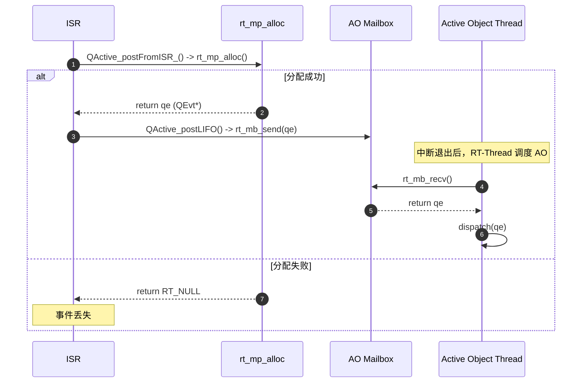
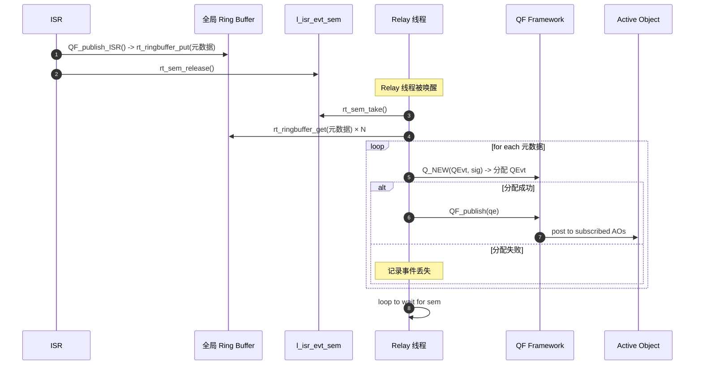

# 两种ISR两种方案的对比：QActive_postFromISR vs. QF_publish_ISR + Relay

## 概述

在 RT-Thread 平台下对接 QP/C，**中断安全发布**既要保证 ISR 执行轻量化，又要满足事件调度的实时性与可靠性。QPC的[rtthread_mempool_margin](https://github.com/stallion5632/qpc-rtthread/tree/rtthread_mempool_margin)分支提供了两种实现方案，下面从**实现原理**、**数据结构**、**发布流程**、**功能扩展**、**性能开销**等维度，对这两种方案进行对比。

1. **方案一: `QActive_postFromISR_()`**：ISR 直接从 RT-Thread 的**中断安全内存池**中分配 `QEvt*`，并将其投递给目标活动对象（AO）的邮箱。
2. **方案二: `QF_publish_ISR()` + Relay 线程**：ISR 将事件的最小化元数据写入一个全局**环形缓冲区**，由一个专用的高优先级 "Relay" 线程负责从中读取数据、分配事件并进行发布。

## 总体对比

| 特性／方案     | QActive_postFromISR_ (直投方案)                              | QF_publish_ISR + Relay 线程 (中继方案)                       |
| -------------- | ------------------------------------------------------------ | ------------------------------------------------------------ |
| **核心思路**   | ISR 调用 `rt_mp_alloc` 分配事件，通过 `rt_mb_send` 直接投递到 AO 邮箱。 | ISR 写元数据到 Ring Buffer；Relay 线程被唤醒后，批量进行 `Q_NEW` + `QF_publish`。 |
| **事件准备**   | **在 ISR 中使用 `rt_mp_alloc()` 实时分配**，要求 RT-Thread 内核使能 `RT_USING_MEMPOOL_FROM_INTERRUPT`。 | **由 Relay 线程在线程上下文分配**。ISR 无需也不能进行任何 `alloc` 操作。 |
| **发布范围**   | 面向单个 AO（`QActive_post`）。若要广播，需在 ISR 中遍历订阅表（不推荐）。 | 主要面向全局广播（`QF_publish`），设计上更适合一对多的事件发布。 |
| **调度机制**   | ISR 中 `rt_mb_send` 直接使 AO 线程就绪，中断退出后即可被 RT-Thread 调度。 | ISR 释放信号量唤醒 Relay 线程，Relay 线程处理完毕后，再由 QP/C 框架调度最终的 AO。 |
| **队列结构**   | 每个 AO 对应一个 RT-Thread Mailbox (`me->eQueue`)。          | 一个全局的、ISR 安全的**单环形缓冲区** (`l_isr_evt_queue`) 用于暂存元数据。 |
| **溢出保护**   | 依赖内存池和 Mailbox 容量。`rt_mp_alloc` 失败或 `rt_mb_send` 失败，事件都会丢失。 | **环形缓冲区满则记录丢失计数 (`l_lost_cnt`)**。提供了比方案一更明确的溢出反馈。 |
| **批量处理**   | 无批量处理，单个事件即时分配并入队。                         | Relay 线程可按 `RELAY_MAX_BATCH` 一次性处理多个事件，提高吞吐量。 |
| **实现复杂度** | **低**：逻辑简单直接，代码量少。                             | **中等**：涉及环形缓冲区、Relay 线程、信号量同步，逻辑更复杂。 |
| **资源占用**   | 每个 AO 一个 `rt_mailbox_t`。依赖 RT-Thread 的中断安全内存池。 | 全局环形缓冲区、Relay 线程的栈和控制块、一个 `rt_semaphore`。 |
| **端到端延迟** | **更低**：ISR → 分配 → 邮箱 → AO 处理。路径最短。            | **较高**：ISR → 缓冲 → Relay 唤醒 → 分配发布 → AO 处理。增加了中继线程的调度延迟。 |
| **适用场景**   | 延迟敏感、事件源与目标 AO 明确、不希望引入额外线程的场景。   | 事件发布频繁（事件风暴）、需要全局广播、能容忍稍高延迟以换取系统稳定性的场景。 |

## 方案一：`QActive_postFromISR_` (直投方案)

### 1. 发布流程

1. **ISR** 调用 `QActive_postFromISR_(me, sig, params, p_event_size)`。

   ```c
   // 示例调用
   QActive_postFromISR_(&AO_Table, TABLE_FULL_SIG, 0, 0); // 0 表示使用默认 QEvt 大小
   ```

2. **在 ISR 中分配事件**:

   - 函数内部调用 `rt_mp_alloc(l_qevt_pool, RT_WAITING_NO)`。
   - 这是一个**中断安全的内存分配**。如果内存池耗尽，`rt_mp_alloc` 返回 `RT_NULL`，事件发布失败。

3. **填充事件并投递**:

   - 如果分配成功，则填充事件的信号 `sig` 和动态参数 `params`。
   - 调用 `QActive_postLIFO(me, qe)`，其内部为 `rt_mb_send(&me->eQueue, (rt_ubase_t)qe)`。

4. **调度与处理**:

   - `rt_mb_send()` 将事件指针放入 AO 的邮箱。如果 AO 线程正在等待，则将其唤醒。
   - 中断退出后，RT-Thread 调度器运行就绪的 AO 线程。

### 2. 时序图



### 3. 优势与风险

- **优势**: 延迟最低，实现简单，资源占用少。
- **风险**: `rt_mp_alloc` 在 ISR 中的执行时间有微小不确定性。如果事件频繁爆发，可能瞬间耗尽内存池，导致事件大量丢失。

## 方案二：`QF_publish_ISR()` + Relay 线程 (中继方案)

### 1. 数据结构

- **环形缓冲区**:

  ```c
  static rt_ringbuffer_t *l_isr_evt_queue;
  ```

- **事件元数据**:

  ```c
  typedef struct
  {
      QSignal sig;
      void *p_sender;
      uint32_t params;
  } isr_evt_t;
  ```

- **同步与控制**:

  - `static rt_sem_t l_isr_evt_sem;`：用于唤醒 Relay 线程。
  - `static rt_thread_t l_relay_thread;`：Relay 线程句柄。
  - `static volatile uint32_t l_lost_cnt = 0U;`：丢失事件计数器。

### 2. 发布流程

1. **ISR** 调用 `QF_publish_ISR(sig, params, p_sender)`。
2. **写入元数据到 Ring Buffer**:
   - 构建一个 `isr_evt_t` 结构体实例。
   - 调用 `rt_ringbuffer_put()` 将该元数据写入 `l_isr_evt_queue`。
   - 如果环形缓冲区已满，则增加 `l_lost_cnt` 计数，元数据被丢弃。
3. **唤醒 Relay 线程**:
   - 调用 `rt_sem_release(&l_isr_evt_sem)`。
4. **Relay 线程 (`relay_thread_entry`)**:
   - `rt_sem_take(&l_isr_evt_sem, RT_WAITING_FOREVER)` 循环等待信号量。
   - 被唤醒后，以 `RELAY_MAX_BATCH` 为上限，循环从 `l_isr_evt_queue` 中取出元数据。
   - 对每一条元数据，调用 `Q_NEW(QEvt, sig)` 从 QP/C 的**线程安全事件池**中分配一个 `QEvt` 对象。
   - 填充事件参数，并调用 `QF_publish(qe)` 将事件广播给所有订阅者。
   - 如果 `Q_NEW` 分配失败，也会记录为丢失事件。

### 3. 时序图




### 4. 优势与取舍

- **优势**: 将 ISR 的工作量降至最低，隔离了内存分配等耗时操作，通过缓冲和批量处理提高了系统应对事件风暴的鲁棒性。
- **取舍**: 增加了额外的线程和数据结构的开销，并引入了从 ISR 到最终 AO 处理的额外调度延迟。

## 选择建议

- 对于 **“快而简”** 的需求，选择**方案一 (`QActive_postFromISR_`)**。它拥有最低的延迟和最少的资源占用，适用于事件源和目标明确、并且中断频率可控的系统。
- 对于 **“稳而全”** 的需求，选择**方案二 (`QF_publish_ISR + Relay`)**。它提供了更好的削峰填谷能力和溢出保护机制，适用于事件可能突发、需要全局广播或系统复杂度较高的场景。
